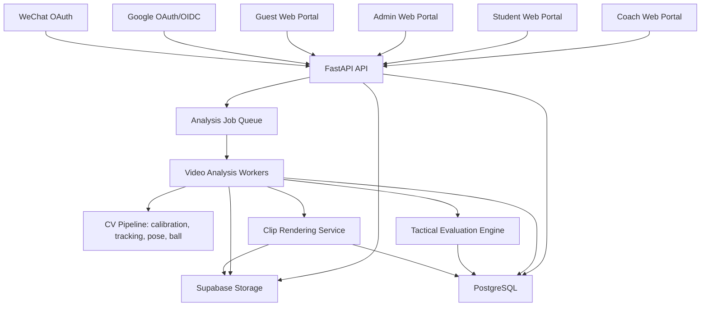
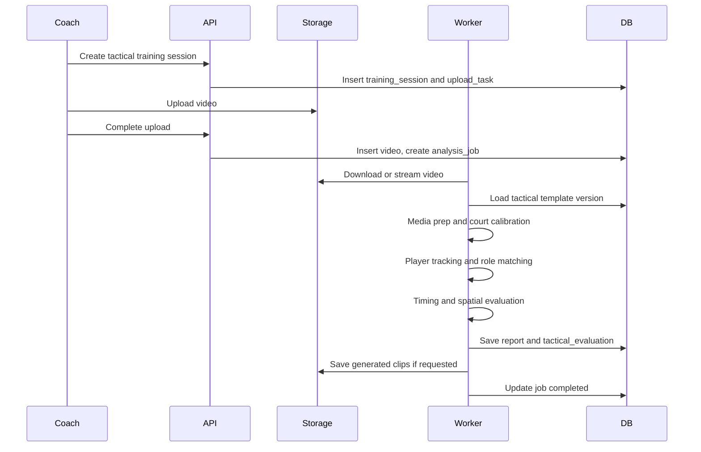
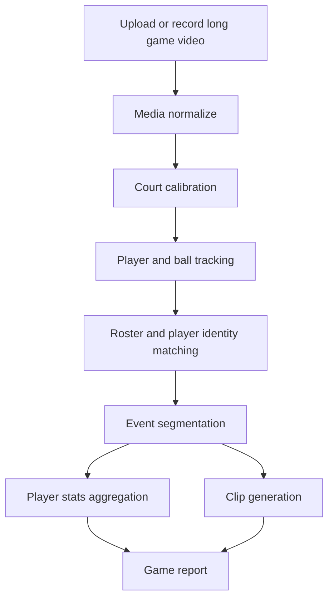

# 第二阶段架构设计：战术训练、视频剪辑与比赛分析

最后更新：2026-05-18

## 0. 设计目标

第二阶段架构要在现有 Next.js + FastAPI + PostgreSQL + Supabase Storage 基础上扩展，而不是推倒重来。

核心原则：

- PostgreSQL 继续作为业务主记录源。
- Supabase Storage 继续作为视频和剪辑对象存储，未来可替换为 S3 兼容存储。
- 模板、评分、报告、任务、剪辑、比赛事件必须可追溯版本。
- 2D 战术动画必须基于标准球场坐标，不依赖页面像素。
- 视频分析必须异步化，避免长任务阻塞普通 API。
- AI 自动分析结果必须支持教练人工校正。
- Google/微信第三方身份、游客模式和正式账号权限必须在服务端清晰区分。
- subgroup QR Code 入班必须使用可禁用、可过期、可审计的邀请码，不暴露内部 ID。

## 1. 总体架构



## 2. 业务域拆分

建议把第二阶段拆成以下业务域：

| 业务域 | 说明 | 复用现有能力 |
| --- | --- | --- |
| Identity & Access | 用户账号、Google/微信身份、游客模式、服务端权限 | `users`、`user_sessions` 可扩展 |
| Organization | 校区、学期、班级、subgroup、成员 | `training_camps`、`camp_classes`、`class_members` |
| Template | 动作模板、战术模板、评分规则版本 | `training_templates`、`training_template_versions` |
| Session | 单次训练、战术训练、比赛分析任务 | `training_sessions` 可扩展 |
| Media | 原始视频、派生剪辑、封面、动画导出 | `videos` 可扩展，新增 clips |
| Privacy Share | 普通训练报告分享、卡通脸部遮挡、分享资产 | 新增 |
| Analysis Job | 异步分析任务、进度、错误、重试 | 新增 |
| Tactical | 战术 DSL、角色、路线、触发点、容错区 | 新增 |
| Tracking | 半场标定、球员轨迹、球轨迹、角色匹配 | 新增 |
| Report | 动作报告、战术报告、比赛报告 | 扩展 `analysis_reports` |
| Game | 比赛、阵容、事件、球员统计 | 新增 |

## 3. 关键架构决策

### 3.1 增加异步分析层

当前上传和报告链路已经有 `training_sessions`、`upload_tasks`、`videos`、`analysis_reports`。第二阶段视频会更长，分析会更复杂，必须增加异步 job 层。

建议新增：

- `analysis_jobs`
- `analysis_job_events`

`analysis_jobs` 负责统一调度：

- 单人动作分析
- 战术训练分析
- 比赛长视频分析
- 剪辑生成
- 动画导出

建议状态：

- `created`
- `queued`
- `media_preparing`
- `calibration_required`
- `tracking`
- `evaluating`
- `rendering_clips`
- `completed`
- `failed`
- `cancelled`

### 3.2 增加标准球场坐标系

战术动画、真实跑位、空间评分必须使用同一套坐标。

建议坐标层：

| 坐标层 | 用途 |
| --- | --- |
| Video Pixel | 原始视频画面像素坐标 |
| Court Metric | 真实半场米制坐标 |
| Court Normalized | 标准半场归一化坐标，前端动画优先使用 |
| Animation View | 前端 canvas/svg 渲染坐标 |

视频分析通过半场标定得到 homography，把视频像素坐标映射到球场坐标。战术模板直接定义在 Court Normalized 或 Court Metric 上。

### 3.3 战术模板必须结构化

战术不能只保存图片或自由文本。建议引入 Tactical DSL，用 JSONB 表达：

- 球员角色
- 起点
- 路线关键帧
- 传球点
- 掩护点
- 汇合点
- 触发条件
- 目标时间窗
- 空间容错区
- 评分权重

示例结构：

```json
{
  "court": "half_court",
  "roles": [
    { "roleId": "P1", "label": "1", "start": { "x": 0.5, "y": 0.88 } },
    { "roleId": "P2", "label": "2", "start": { "x": 0.18, "y": 0.62 } }
  ],
  "timeline": [
    {
      "stepId": "p1_entry",
      "roleId": "P1",
      "type": "move",
      "path": [
        { "t": 0, "x": 0.5, "y": 0.88 },
        { "t": 2.2, "x": 0.62, "y": 0.56 }
      ],
      "targetWindowSec": { "min": 1.8, "max": 2.8 },
      "spatialToleranceMeters": 0.45
    },
    {
      "stepId": "p2_cut",
      "roleId": "P2",
      "type": "move",
      "trigger": { "roleId": "P1", "event": "arrive", "stepId": "p1_entry" },
      "path": [
        { "dt": 0, "x": 0.18, "y": 0.62 },
        { "dt": 1.5, "x": 0.38, "y": 0.36 }
      ],
      "spatialToleranceMeters": 0.45
    }
  ]
}
```

## 4. 数据模型建议

### 4.1 身份与访问控制

当前已有：

- `users`
- `user_sessions`
- `verification_codes`

第二阶段建议新增第三方身份绑定表，避免把 Google、微信、密码等不同登录方式硬塞进 `users`。

#### `auth_identities`

| 字段 | 说明 |
| --- | --- |
| `user_id` | 关联 `users` |
| `provider` | password / google / wechat |
| `provider_subject` | provider 内部用户 ID，例如 Google sub、微信 openid |
| `provider_union_id` | 微信 unionid，可空 |
| `email` | provider 返回的 email，可空 |
| `phone_number` | provider 返回或补充的手机号，可空 |
| `display_name` | provider 昵称 |
| `avatar_url` | provider 头像 |
| `metadata` JSONB | provider 原始摘要、scope、平台类型 |
| `last_login_at` | 最近登录 |

建议约束：

- `unique(provider, provider_subject)`
- `unique(provider, provider_union_id) where provider_union_id is not null`
- 一个 `user_id` 可以绑定多个 provider。

#### `guest_sessions`

游客模式可以不创建正式 `users` 记录，但服务端仍建议有轻量 session 用于限流和安全审计。

| 字段 | 说明 |
| --- | --- |
| `session_token_hash` | 游客 session token hash |
| `started_at` | 开始时间 |
| `expires_at` | 过期时间 |
| `last_seen_at` | 最近访问 |
| `metadata` JSONB | 设备、来源、实验标记 |

游客权限边界：

- 可以读公开模板、公开 demo、样例报告。
- 不能创建 `training_sessions`、`upload_tasks`、`analysis_jobs`、`class_members`。
- 不能访问任何私有 report、class、student、coach、game 数据。

### 4.2 组织与班级

当前已有：

- `training_camps`
- `camp_classes`
- `class_members`

建议第二阶段新增或扩展：

#### `campuses`

| 字段 | 说明 |
| --- | --- |
| `id` | 内部主键 |
| `public_id` | 对外 ID |
| `name` | 校区名称 |
| `code` | 校区编码 |
| `address` | 地址 |
| `timezone` | 默认时区 |
| `status` | active / inactive |

#### `academic_terms`

| 字段 | 说明 |
| --- | --- |
| `id` | 内部主键 |
| `public_id` | 对外 ID |
| `year` | 年份，例如 2026 |
| `term_code` | term1 / term2 / term3 / term4 / holiday_term_1 / holiday_term_2 |
| `name` | 展示名称 |
| `start_date` | 开始日期 |
| `end_date` | 结束日期 |
| `status` | draft / active / archived |

#### `camp_classes` 扩展

短期保留现有表名，但把语义升级为“一个校区、一个学期、一个或多个星期几、一个固定时间段的 class”。

建议增加：

- `campus_id`
- `term_id`
- `weekdays` JSONB，例如 `["mon", "wed"]`
- `start_time`
- `end_time`
- `timezone`
- `auto_title`
- `custom_title`

#### `class_subgroups`

新增小班表：

| 字段 | 说明 |
| --- | --- |
| `class_id` | 关联 `camp_classes` |
| `name` | 小班名称 |
| `age_group` | 年龄段 |
| `level` | beginner / intermediate / advanced |
| `primary_coach_id` | 主教练 |
| `max_students` | 容量 |
| `status` | active / inactive |

#### `class_join_invites`

每个 subgroup 的 QR Code 不应直接暴露 subgroup public id，而应指向一个 invite code。

| 字段 | 说明 |
| --- | --- |
| `class_id` | 关联 `camp_classes` |
| `subgroup_id` | 关联 `class_subgroups` |
| `invite_code` | 短码，用于 URL |
| `token_hash` | invite token hash |
| `join_mode` | auto_join / approval_required |
| `max_uses` | 最大使用次数，可空 |
| `used_count` | 已使用次数 |
| `expires_at` | 过期时间，可空 |
| `status` | active / disabled / expired |
| `created_by_user_id` | 创建人 |
| `metadata` JSONB | QR 样式、来源、备注 |

#### `class_join_requests`

用于记录扫码加入历史，并支持后续审核模式。

| 字段 | 说明 |
| --- | --- |
| `invite_id` | 关联 `class_join_invites` |
| `student_id` | 申请学生 |
| `class_id` | 冗余关联 class |
| `subgroup_id` | 冗余关联 subgroup |
| `status` | joined / pending / rejected / cancelled |
| `reviewed_by_user_id` | 审核人，可空 |
| `joined_at` | 加入时间，可空 |
| `metadata` JSONB | 设备、来源、失败原因 |

#### `class_members` 扩展

建议增加：

- `subgroup_id nullable`
- `join_source`，例如 admin_assign / qr_code / import
- `join_invite_id nullable`
- `assigned_by_user_id nullable`

这样同一时间段 class 下可以有多个 subgroup，学员和教练可以归属到具体小班。

### 4.3 模板与战术

当前已有：

- `training_templates`
- `training_template_versions`

建议新增 `AnalysisType`：

- `tactical`
- `game`

建议新增：

#### `tactical_play_specs`

一份战术模板版本对应一份结构化战术定义。

| 字段 | 说明 |
| --- | --- |
| `template_version_id` | 关联 `training_template_versions` |
| `court_type` | half_court / full_court |
| `player_count` | 3 / 4 / 5 |
| `role_definitions` JSONB | 角色、起点、编号 |
| `timeline` JSONB | 路线、关键帧、触发条件 |
| `tolerance_config` JSONB | 空间和时间容错 |
| `animation_config` JSONB | 2D/3D 展示配置 |
| `status` | draft / active / archived |

`training_template_versions.scoring_rules` 继续保存评分权重和规则摘要，`tactical_play_specs` 保存战术空间和时间定义。

### 4.4 视频标定与追踪

#### `court_calibrations`

| 字段 | 说明 |
| --- | --- |
| `video_id` | 关联原始视频 |
| `session_id` | 可选关联训练 session |
| `calibration_points` JSONB | 视频点和球场点 |
| `homography` JSONB | 映射矩阵 |
| `court_type` | half_court / full_court |
| `status` | draft / confirmed / failed |

#### `tracked_players`

| 字段 | 说明 |
| --- | --- |
| `video_id` | 关联视频 |
| `track_id` | 追踪 ID |
| `display_label` | 临时标签或球衣号 |
| `student_id` | 可选绑定学员 |
| `confidence` | 身份置信度 |
| `metadata` JSONB | 颜色、号码、人工备注 |

#### `player_track_points`

高频轨迹点数据量可能较大。P1 可先存 JSONB 压缩轨迹，P2 再拆分到明细表或对象存储。

建议字段：

- `tracked_player_id`
- `time_sec`
- `video_x`
- `video_y`
- `court_x`
- `court_y`
- `pose_keypoints` JSONB nullable
- `confidence`

### 4.5 战术执行与报告

#### `tactical_attempts`

表示一个视频中的一次战术执行回合。

| 字段 | 说明 |
| --- | --- |
| `session_id` | 训练 session |
| `video_id` | 视频 |
| `template_version_id` | 使用的战术版本 |
| `start_sec` | 回合开始 |
| `end_sec` | 回合结束 |
| `role_assignments` JSONB | 模板角色到真实 track/student 的映射 |
| `status` | detected / reviewed / rejected |

#### `tactical_evaluations`

保存战术执行评分结果。

| 字段 | 说明 |
| --- | --- |
| `attempt_id` | 关联战术回合 |
| `report_id` | 关联 `analysis_reports` |
| `overall_score` | 总分 |
| `timing_score` | 时间评分 |
| `spacing_score` | 空间评分 |
| `team_sync_score` | 协同评分 |
| `findings` JSONB | 问题列表 |
| `recommendations` JSONB | 建议列表 |
| `route_delta` JSONB | 路线偏差 |

### 4.6 剪辑资产

#### `video_clips`

| 字段 | 说明 |
| --- | --- |
| `source_video_id` | 原始视频 |
| `clip_video_id` | 生成后的视频对象，可复用 `videos` |
| `owner_user_id` | 创建人 |
| `student_id` | 关联学员，可空 |
| `tracked_player_id` | 关联追踪球员，可空 |
| `event_type` | run / shot_attempt / pass / catch 等 |
| `start_sec` | 开始时间 |
| `end_sec` | 结束时间 |
| `status` | queued / rendering / completed / failed |
| `metadata` JSONB | 标签、置信度、人工修正 |

#### `clip_collections`

用于一组高光合集，例如某球员一场比赛所有投篮。

| 字段 | 说明 |
| --- | --- |
| `title` | 合集标题 |
| `collection_type` | player_shots / player_passes / tactic_attempts |
| `created_by_user_id` | 创建人 |
| `metadata` JSONB | 过滤条件 |

#### `clip_collection_items`

保存合集内 clip 顺序。

### 4.7 报告分享与隐私资产

该能力只作用于普通训练报告分享，即运球和 training 页面生成的视频报告，不包含战术训练报告。

#### `report_share_assets`

| 字段 | 说明 |
| --- | --- |
| `report_id` | 关联 `analysis_reports` |
| `source_video_id` | 原始视频 |
| `share_video_id` | 生成后的分享视频，可复用 `videos` |
| `student_id` | 报告所属学生 |
| `privacy_effect` | none / cartoon_face_mask |
| `status` | queued / rendering / preview_ready / completed / failed |
| `face_detection_summary` JSONB | 人脸检测置信度、遮挡帧比例、失败原因 |
| `preview_url` | 分享前预览资源 |
| `share_url` | 正式分享资源 |
| `expires_at` | 分享链接过期时间，可空 |
| `metadata` JSONB | 卡通样式、导出参数 |

实现原则：

- 不修改原始上传视频。
- 卡通脸部遮挡只作用于分享版本或导出版本。
- 低置信度时不应静默生成，需要提示用户预览或重新生成。
- 原始报告仍按权限控制给学生、教练、Admin 查看。

### 4.8 比赛长视频

#### `game_sessions`

| 字段 | 说明 |
| --- | --- |
| `class_id` | 可选关联班级 |
| `team_name` | 本队名称 |
| `opponent_name` | 对手名称 |
| `game_date` | 比赛日期 |
| `video_id` | 主视频 |
| `status` | created / analyzing / completed / failed |

#### `game_rosters`

| 字段 | 说明 |
| --- | --- |
| `game_session_id` | 比赛 |
| `student_id` | 可选绑定学员 |
| `jersey_number` | 球衣号 |
| `display_name` | 名称 |
| `tracked_player_id` | 可选绑定追踪身份 |

#### `game_events`

| 字段 | 说明 |
| --- | --- |
| `game_session_id` | 比赛 |
| `event_type` | shot_attempt / pass / catch / drive |
| `primary_player_id` | 主要球员 |
| `secondary_player_id` | 传球接收人等 |
| `start_sec` | 开始 |
| `end_sec` | 结束 |
| `confidence` | AI 置信度 |
| `review_status` | auto / reviewed / corrected |
| `metadata` JSONB | 事件细节 |

#### `game_player_stats`

保存比赛统计汇总：

- shot_attempts
- made_shots
- passes
- catches
- turnovers
- clips_count
- custom_metrics JSONB

## 5. 分析流水线

### 5.1 战术训练视频



### 5.2 比赛长视频



### 5.3 视频接入模式

第二阶段统一支持两类输入：

- Upload mode：教练上传已有 mp4/mov 文件，上传完成后创建 `analysis_job`。
- Record mode：Coach Web 或未来移动端使用 MediaRecorder 录制，按 chunk 上传，录制结束后合并为一个 `videos` 记录并创建 `analysis_job`。

P1 不建议把 Record mode 做成真正实时 AI 分析。更稳妥的第一版是“实时录制，结束后异步分析”。后续如果需要边录边出事件，可以增加 stream session、chunk-level tracking 和增量事件写入。

## 6. API 设计建议

### 6.1 Auth 与 Guest

- `GET /api/v1/auth/google/start`
- `GET /api/v1/auth/google/callback`
- `GET /api/v1/auth/wechat/start`
- `GET /api/v1/auth/wechat/callback`
- `POST /api/v1/auth/identities/link`
- `DELETE /api/v1/auth/identities/{identity_public_id}`
- `POST /api/v1/auth/guest/session`
- `GET /api/v1/public/templates`
- `GET /api/v1/public/demo-reports`
- `GET /api/v1/public/features`

第三方注册完成后默认创建 `student` 角色账号。角色提升、coach/admin 创建仍必须走 Admin 权限流程。

### 6.2 Admin

- `GET /api/v1/admin/campuses`
- `POST /api/v1/admin/campuses`
- `PATCH /api/v1/admin/campuses/{campus_public_id}`
- `GET /api/v1/admin/terms`
- `POST /api/v1/admin/terms`
- `GET /api/v1/admin/classes`
- `POST /api/v1/admin/classes`
- `POST /api/v1/admin/classes/{class_public_id}/subgroups`
- `PATCH /api/v1/admin/classes/{class_public_id}/subgroups/{subgroup_public_id}`
- `POST /api/v1/admin/classes/{class_public_id}/subgroups/{subgroup_public_id}/invite`
- `PATCH /api/v1/admin/class-invites/{invite_public_id}`
- `POST /api/v1/admin/class-invites/{invite_public_id}/regenerate`
- `GET /api/v1/admin/class-invites/{invite_public_id}/requests`
- `POST /api/v1/admin/classes/{class_public_id}/members/bulk`

### 6.3 Coach 战术模板

- `GET /api/v1/coach/tactical-templates`
- `POST /api/v1/coach/tactical-templates`
- `GET /api/v1/coach/tactical-templates/{template_public_id}`
- `POST /api/v1/coach/tactical-templates/{template_public_id}/versions`
- `POST /api/v1/coach/tactical-templates/parse-instruction`
- `POST /api/v1/coach/tactical-templates/{template_public_id}/animation-preview`
- `POST /api/v1/coach/tactical-templates/{template_public_id}/publish`

### 6.4 Coach 战术训练分析

- `POST /api/v1/coach/tactical-sessions`
- `POST /api/v1/coach/tactical-sessions/{session_public_id}/upload/init`
- `POST /api/v1/coach/tactical-sessions/{session_public_id}/upload/complete`
- `POST /api/v1/coach/tactical-sessions/{session_public_id}/calibration`
- `POST /api/v1/coach/tactical-sessions/{session_public_id}/analyze`
- `GET /api/v1/coach/tactical-sessions/{session_public_id}/report`
- `POST /api/v1/coach/tactical-sessions/{session_public_id}/clips`

### 6.5 Coach 比赛视频

- `POST /api/v1/coach/game-sessions`
- `POST /api/v1/coach/game-sessions/{game_public_id}/upload/init`
- `POST /api/v1/coach/game-sessions/{game_public_id}/upload/complete`
- `POST /api/v1/coach/game-sessions/{game_public_id}/roster`
- `POST /api/v1/coach/game-sessions/{game_public_id}/analyze`
- `GET /api/v1/coach/game-sessions/{game_public_id}/events`
- `GET /api/v1/coach/game-sessions/{game_public_id}/player-stats`
- `POST /api/v1/coach/game-sessions/{game_public_id}/clips`

### 6.6 Student

- `GET /api/v1/me/trends?analysis_type=shooting`
- `GET /api/v1/me/trends?analysis_type=dribbling`
- `GET /api/v1/me/trends?analysis_type=training`
- `GET /api/v1/me/tasks/{assignment_public_id}/eligible-reports`
- `POST /api/v1/me/tasks/{assignment_public_id}/submit-report`
- `GET /api/v1/me/tactical-reports`
- `GET /api/v1/me/clips`
- `POST /api/v1/me/reports/{report_public_id}/share-assets`
- `GET /api/v1/me/reports/{report_public_id}/share-assets/{share_asset_public_id}`
- `POST /api/v1/me/reports/{report_public_id}/share-assets/{share_asset_public_id}/publish`
- `GET /api/v1/class-invites/{invite_code}`
- `POST /api/v1/class-invites/{invite_code}/join`

### 6.7 权限矩阵

| 能力 | Guest | Student | Coach | Admin |
| --- | --- | --- | --- | --- |
| 浏览公开功能和 demo | yes | yes | yes | yes |
| 上传训练视频 | no | yes | yes | yes |
| 创建分析 job | no | yes | yes | yes |
| 查看自己的报告 | no | yes | yes | yes |
| 生成报告分享卡通脸部遮挡 | no | yes，仅自己报告 | no | limited，运营排查 |
| 加入 subgroup | no，需登录后加入 | yes | no | yes，手动分配 |
| 生成/管理 subgroup QR Code | no | no | limited，后续可配置 | yes |
| 查看班级私有数据 | no | 自己相关 | 自己负责班级 | all |

服务端必须以认证身份和角色做最终校验，前端隐藏按钮不能作为权限控制。

## 7. 2D/3D 前端架构

### 7.1 2D 战术板

建议使用一个明确的战术编辑器模块：

- Court canvas
- Player tokens
- Ball token
- Route editor
- Trigger editor
- Timeline editor
- Tolerance zone overlay
- Animation player

2D 渲染可以用 Canvas、SVG 或 Pixi。关键不是技术选型，而是所有图形都来自标准球场坐标。

### 7.2 3D 预览

3D 可以用 Three.js，从同一份 Tactical DSL 生成：

- 球场模型
- 球员简化模型
- 跑位轨迹
- 传球轨迹

3D 第一版只做展示，不参与评分。

## 8. AI 和 CV 实现分层

建议把视频智能能力拆成独立服务接口，避免业务代码直接依赖某个模型。

| 模块 | 输入 | 输出 |
| --- | --- | --- |
| Court Calibration | 视频帧、人工点位 | homography、球场坐标 |
| Player Detection | 视频帧 | player boxes |
| Player Tracking | player boxes | track ids |
| Pose Estimation | player crops 或帧 | keypoints |
| Ball Tracking | 视频帧 | ball positions |
| Role Matching | track ids、模板角色 | role assignments |
| Tactical Evaluation | role tracks、template DSL | score、findings |
| Event Detection | tracks、ball、pose | game events |
| Clip Rendering | source video、time ranges | clip videos |

P1 应优先完成“人工可校正”的闭环：

- 手动半场标定
- 手动锁定球员或修正身份
- AI 生成建议
- 教练确认剪辑

## 9. 和第一阶段的衔接

### 9.1 AnalysisType

当前已有：

- `shooting`
- `dribbling`
- `training`
- `comprehensive`

建议第二阶段增加：

- `tactical`
- `game`

### 9.2 Report

`analysis_reports` 可以继续作为报告主表，但 `score_data`、`timeline_data`、`summary_data` 需要支持新结构。

建议约定：

- 单人动作报告：继续使用当前结构。
- 战术报告：`score_data` 包含 timing、spacing、team_sync。
- 比赛报告：`score_data` 包含事件统计和球员统计。
- 复杂明细放到新表，如 `tactical_evaluations`、`game_events`。

### 9.3 Task

`training_tasks.target_config` 建议扩展：

```json
{
  "submissionModes": ["new_upload", "existing_report", "coach_review"],
  "allowedAnalysisTypes": ["shooting", "dribbling", "training", "tactical"],
  "allowReportReuse": false,
  "requiredTemplateCodes": ["shoot_front_form_close"]
}
```

### 9.4 Trends

趋势聚合应按 `analysis_type` 维度生成。当前 `student_growth_snapshots.analysis_type` 已有方向，第二阶段应把前端图表改为按类型读取。

## 10. 实施路线

### P0：先补业务地基

- 新增 Google/微信第三方身份绑定模型和登录注册流程。
- 新增游客模式服务端权限边界和公开 demo API。
- 新增 campus、academic term、class subgroup 数据模型。
- 升级 Admin class 创建流程。
- 为 subgroup 增加 QR Code invite、扫码入班和禁用/重生成能力。
- 任务提交增加 eligible reports 和显式选择。
- 增加运球/training 报告分享资产模型和卡通脸部遮挡任务。
- 趋势图按 analysis type 拆分。
- 模板评分规则版本化和 dry-run 流程文档化。
- 增加 `analysis_jobs` 基础表和 service。

### P1：完成战术训练 MVP

- 战术板编辑器和 Tactical DSL。
- 2D 动画播放器。
- 战术模板保存、版本发布。
- 固定半场视频上传和人工标定。
- 球员轨迹导入或基础自动追踪。
- 战术时间点和空间点评分。
- 战术训练报告。
- 指定球员跑位 clip 导出。

### P2：比赛长视频和高光增强

- Game session、roster、game events、player stats。
- 长视频异步分析。
- 教练锁定和切换球员。
- 投篮、传球、接球事件初筛。
- 批量 clip 导出。
- 高光合集。

### P3：智能化增强

- 语音生成战术草稿。
- 手绘战术识别。
- 3D 战术演示。
- 自动半场标定。
- 更稳定的球员 ReID。
- 更完整的比赛评分标准。

## 11. 测试与验收策略

### 11.1 单元测试

- Tactical DSL parser。
- 时间窗评分。
- 空间距离评分。
- trigger 触发逻辑。
- task eligible reports 筛选。
- class title 自动生成。
- Google/微信 identity 去重和绑定逻辑。
- QR invite 过期、禁用、重复加入、容量校验。
- Guest 权限拒绝上传和写入操作。
- report share asset 权限、状态流转、低置信度遮挡提示。

### 11.2 集成测试

- 上传视频到生成 analysis job。
- job 完成后生成 report。
- report 关联 task。
- clip 生成后写入 `video_clips`。
- Admin 创建 campus、term、class、subgroup。
- Admin 为 subgroup 生成 QR Code，Student 扫码加入 subgroup。
- Guest 访问公开 demo 成功，但访问上传、任务、报告写入接口被拒绝。
- Google/微信新用户注册后创建 Student 账号，老用户可绑定第三方身份。
- Student 为自己的运球/training 报告生成卡通脸部遮挡分享预览。

### 11.3 人工验收

- 使用一套 5 人半场战术，从绘制到动画播放。
- 上传一段固定机位训练视频，完成标定和报告。
- 导出指定球员跑位片段。
- 上传一段比赛长视频，锁定球员并生成投篮片段列表。
- 扫描 subgroup QR Code，完成注册/登录后进入正确小班。
- 游客浏览公开功能后，点击上传入口会被引导登录或注册。
- 学生分享普通训练报告时，可以预览并发布带卡通脸部遮挡的分享版本。

## 12. 技术风险和缓解

| 风险 | 缓解方式 |
| --- | --- |
| 多人遮挡导致追踪丢失 | P1 支持人工修正 track 和角色 |
| 镜头角度不标准 | P1 强制半场标定，提供拍摄指南 |
| 自动事件识别不稳定 | 第一版 AI 初筛 + 教练审核 |
| 战术模板自由度过高 | 用 Tactical DSL 和版本发布流程收敛 |
| 长视频处理耗时 | 异步 job、进度条、失败重试、后台通知 |
| 历史报告被新规则影响 | 每份报告固定 template version |
| 第三方注册产生重复账号 | 使用 `auth_identities` 做 provider 级唯一约束，并提供账号绑定流程 |
| subgroup QR Code 被误传 | invite 支持禁用、过期、重生成、容量限制和加入审计 |
| 游客权限误放开 | 服务端统一鉴权，所有写入 API 显式拒绝 guest session |
| 卡通脸部遮挡识别不稳定 | 分享前必须有预览，低置信度时提示重新生成、人工调整或仅分享无视频报告 |
