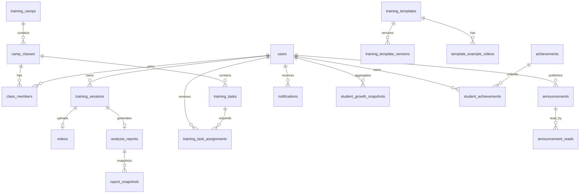

# AI 篮球训练营 Web 端后端与数据库设计文档

## 0. 关联文档

本文档用于定义“这一阶段后端和数据库应该如何设计”。

建议配合以下文档一起看：

- 实施状态说明：
  [training-camp-backend-implementation-status.md](<D:\githubproject\ai-hoops-cloud\docs\training-camp-backend-implementation-status.md>)
- 下一轮任务拆解清单：
  [training-camp-backend-next-iteration-task-breakdown.md](<D:\githubproject\ai-hoops-cloud\docs\training-camp-backend-next-iteration-task-breakdown.md>)

三份文档之间的关系是：

- 本文档：定义目标设计
- 实施状态文档：记录当前做到哪里
- 下一轮任务拆解文档：定义接下来按什么顺序继续开发

## 1. 文档目标

本文档用于整理 AI 篮球训练营 Web 端当前阶段的后端与数据库设计，重点服务于以下开发工作：

- 后端业务建模
- 数据库关系设计
- 数据库表设计
- 字段定义与索引约束设计
- 前后端接口边界设计
- 当前过渡期架构向统一后端收口的迁移设计

当前阶段的明确前提：

- 暂未实现完整多角色访问控制系统
- 前端部署在 Vercel
- 后端服务和 PostgreSQL 数据库运行在 Render
- 视频文件上传与存储使用 Supabase Storage
- 本阶段优先做后端主记录源与数据库设计，不优先做 AWS 全量迁移

## 2. 本阶段范围与非目标

### 2.1 本阶段范围

- 支撑 `Student / Coach / Admin` 三类角色的基础业务
- 建立训练营、班级、模板、训练记录、报告、任务、公告、成长、成就等核心数据模型
- 让 PostgreSQL 成为用户、班级、任务、报告、趋势、成就的系统主记录源
- 让 Supabase 只承担视频对象存储与签名访问，不承担核心业务主数据

### 2.2 本阶段非目标

- 不做完整 RBAC 权限模型
- 不做家长独立角色
- 不优先做复杂 IM 能力，例如撤回、已编辑、敏感词、消息审核、离线同步优化
- 不优先做计费、订阅、支付
- 不优先做 AWS 全量基础设施切换

## 3. 当前系统边界与设计原则

### 3.1 当前系统边界

| 层 | 当前方案 | 说明 |
| --- | --- | --- |
| 前端 | Next.js on Vercel | 页面展示、上传入口、报告查看、管理台 |
| 后端 | FastAPI on Render | 鉴权、业务 API、分析调度、数据读写 |
| 业务数据库 | PostgreSQL on Render | 系统主记录源 |
| 对象存储 | Supabase Storage | 训练视频、模板示例视频 |
| AI 分析 | MediaPipe + 模板评分规则 | 建议由后端异步任务执行 |

### 3.2 设计原则

1. `PostgreSQL` 是业务主记录源。
   视频文件本体存储在 Supabase，但视频元数据、训练记录、报告、任务、公告、趋势、成就都应保存在 PostgreSQL。

2. 先做“基于角色 + 归属关系”的访问控制，不做完整 RBAC。
   当前阶段只依赖 `users.role`、班级归属、资源 owner、教练与班级绑定关系做权限判断。

3. 训练业务和技术上传流程分层。
   `training_sessions` 表示业务上的一次训练；`upload_tasks` 表示技术上的上传任务；`videos` 表示最终文件对象；`analysis_reports` 表示 AI 结果。

4. 动态规则放 `JSONB`，可筛选字段结构化。
   例如评分规则、模板配置、趋势明细、成就规则放 `JSONB`；而 `student_id`、`class_id`、`status`、`analysis_type` 这类常用过滤字段必须单独建列。
   目前模板配置ai-hoops-cloud\web\src\config\templates文件夹下

5. 历史可追溯优先。
   报告应保存训练模板版本信息，避免模板规则更新后导致历史报告不可复现。

6. 对外暴露 `public_id`，内部关联使用自增 `id`。
   当前后端模型已经在 mixin 中采用 `public_id`，后续新表建议保持一致。

## 4. 角色模型与阶段性访问控制策略

## 4.1 角色定义

| 角色 | 核心能力 | 当前阶段访问边界 |
| --- | --- | --- |
| Student | 上传视频、选择模板、查看报告、查看历史、查看成长趋势、完成任务、解锁成就 | 仅可访问自己的训练、报告、任务、成就、消息、通知 |
| Coach | 查看班级、查看班级学员、查看学员报告、发布任务、发布公告、管理班级、群聊/私聊 | 仅可访问自己负责班级下的学生与班级资源 |
| Admin | 管理训练营、班级、教练、学生、模板、示例视频、整体数据 | 可访问所有业务资源 |

## 4.2 当前阶段推荐权限实现方式

不新增 `roles`、`permissions`、`role_permissions` 等 RBAC 表，先采用下面的判断模型：

- `Student`：资源拥有者判断
  - `training_sessions.student_id = current_user.id`
  - `videos.user_id = current_user.id`
  - `analysis_reports.user_id = current_user.id`
  - `training_task_assignments.student_id = current_user.id`

- `Coach`：班级归属判断
  - 当前教练必须在 `class_members` 中存在 `member_role = coach`
  - 目标学生必须在同一个 `class_members` 中存在 `member_role = student`
  - 学员报告是否可查看，以报告关联的 `training_sessions.class_id` 为准

- `Admin`：全局访问
  - 允许访问所有训练营、班级、模板、学生、教练、报告、公告等资源

## 4.3 与当前代码的差异

当前 `server/app/models/enums.py` 中的 `UserRole` 为：

- `user`
- `coach`
- `admin`

推荐做法二选一：

- 推荐方案：把 `user` 语义正式收敛为 `student`，并做枚举迁移
- 兼容方案：数据库里暂时保留 `user`，但在业务文档与接口层统一把它解释为 `student`

推荐优先选第一种，后续接口和前端语义更清晰。开发时方案按推荐走

## 5. 核心业务域拆分

本项目建议拆成六个核心业务域：

1. 账号与身份域
   - `users`
   - `user_sessions`
   - `verification_codes`

2. 训练营组织域
   - `training_camps`
   - `camp_classes`
   - `class_members`

3. 模板与示例视频域
   - `training_templates`
   - `training_template_versions`
   - `template_example_videos`

4. 训练与分析域
   - `training_sessions`
   - `upload_tasks`
   - `videos`
   - `analysis_reports`
   - `report_snapshots`

5. 教练运营域
   - `training_tasks`
   - `training_task_assignments`
   - `announcements`
   - `announcement_reads`
   - `notifications`

6. 成长与激励域
   - `student_growth_snapshots`
   - `achievements`
   - `student_achievements`
   - `student_goals`

聊天能力建议单独作为后续域处理，不建议在第一轮数据库设计中做得过重。

## 6. 关键业务流程与数据库交互设计

## 6.1 学员上传视频并生成 AI 报告

### 6.1.1 目标流程

1. 学员选择训练类型与模板
2. 后端创建 `training_session`
3. 后端创建 `upload_task` 并签发 Supabase 上传凭证
4. 前端上传视频到 Supabase Storage
5. 前端回调后端确认上传完成
6. 后端落库 `videos`
7. 后端异步执行 MediaPipe 分析与评分
8. 后端生成 `analysis_reports`
9. 后端写入 `report_snapshots`
10. 后端更新任务完成度、成长趋势、成就、通知

### 6.1.2 建议数据写入顺序

#### 第一步：初始化上传

单事务完成：

- 插入 `training_sessions`
- 插入 `upload_tasks`

关键点：

- `training_sessions.status = created`
- `upload_tasks.status = created`
- 记录 `student_id`、`class_id`、`analysis_type`、`template_code`

#### 第二步：视频上传完成回调

单事务完成：

- 插入或更新 `videos`
- 更新 `upload_tasks.status = uploaded`
- 更新 `training_sessions.status = uploaded`
- 绑定 `training_sessions.video_id`

#### 第三步：开始分析

单事务完成：

- 更新 `training_sessions.status = analyzing`
- 创建 `analysis_reports.status = processing`

#### 第四步：分析完成

单事务完成：

- 更新 `analysis_reports.status = completed`
- 写入 `overall_score`、`grade`、`score_data`、`timeline_data`、`summary_data`
- 插入 `report_snapshots`
- 更新 `training_sessions.status = completed`
- 更新 `training_task_assignments`
- 更新或重算 `student_growth_snapshots`
- 判定并写入 `student_achievements`
- 插入 `notifications`

### 6.1.3 为什么要有 `training_sessions`

当前仅靠 `upload_tasks + videos + analysis_reports` 可以运行技术流程，但不利于表达业务语义。新增 `training_sessions` 后会明显更清晰：

- 它是“学员一次训练行为”的主表
- 可以承载 `class_id`、`task_assignment_id`、`source_type`
- 能把上传失败、分析失败、成功完成都统一管理
- 个人中心历史记录、教练查看训练记录、任务完成追踪都可以直接围绕它展开

## 6.2 个人中心成长记录流程

### 6.2.1 查询来源建议

个人中心不要再直接读 Supabase 的报告表，推荐全部通过后端 API 聚合返回。

推荐读取来源：

- 历史报告：`analysis_reports`
- 训练记录：`training_sessions`
- 趋势数据：`student_growth_snapshots`
- 本周任务：`training_task_assignments`
- 成就数据：`student_achievements`
- 阶段目标：`student_goals`

### 6.2.2 趋势计算建议

趋势不要完全在前端计算，建议后端提供：

- `7d`
- `30d`
- `90d`
- `custom`

两种实现方式：

- P0：先从 `analysis_reports` 实时聚合
- P1：每日或每次报告完成后回写 `student_growth_snapshots`

推荐最终落地到第二种，前端展示更稳定，教练和管理员统计也更容易复用。

## 6.3 教练管理班级流程

### 6.3.1 核心访问链路

教练查看学员训练报告时，建议通过下面的归属链路做权限判断：

- `current_user.id`
- `class_members.member_role = coach`
- `training_sessions.class_id`
- `class_members.member_role = student`
- `analysis_reports.session_id`

### 6.3.2 发布训练任务

教练发布任务时，建议：

1. 创建 `training_tasks`
2. 查出班级当前有效学生
3. 批量插入 `training_task_assignments`
4. 批量插入 `notifications`

这样做的好处是：

- 学员侧查询简单
- 任务完成度天然按学生维度追踪
- 后续逾期统计、已完成率、班级完成率更好做

## 6.4 管理员管理模板与示例视频流程

管理员侧模板管理建议分两层：

- `training_templates`：模板主信息
- `training_template_versions`：模板版本与评分规则

示例视频建议单独管理：

- `template_example_videos`

原因：

- 模板规则会变，但历史报告必须可追溯
- 示例视频和学员训练视频不是同一类业务对象
- 管理员需要对示例视频做新增、修改、删除、排序、上下架

## 7. 数据模型总览

## 8. 数据库表设计

## 8.1 通用约定

建议所有核心业务表遵循以下约定：

- 内部主键：`id bigserial primary key`
- 对外 ID：`public_id uuid unique not null`
- 时间字段：`created_at timestamptz not null`, `updated_at timestamptz not null`
- 软删除字段：需要可恢复删除的表增加 `deleted_at timestamptz null`
- 审计字段：管理后台创建的数据建议增加 `created_by_user_id`、`updated_by_user_id`

## 8.2 现有表建议复用与调整

## 8.2.1 `users`

用途：账号主表，承载登录身份与基础角色。

建议字段：

| 字段 | 类型 | 必填 | 说明 |
| --- | --- | --- | --- |
| `id` | `bigserial` | 是 | 内部主键 |
| `public_id` | `uuid` | 是 | 对外 ID |
| `username` | `varchar(50)` | 是 | 登录用户名，唯一 |
| `password_hash` | `varchar(255)` | 是 | 密码哈希 |
| `phone_number` | `varchar(32)` | 是 | 手机号，唯一 |
| `email` | `varchar(255)` | 否 | 邮箱，唯一索引建议保留部分唯一 |
| `nickname` | `varchar(100)` | 否 | 昵称 |
| `avatar_url` | `varchar(500)` | 否 | 头像 |
| `role` | `enum` | 是 | 推荐值：`student / coach / admin` |
| `status` | `enum` | 是 | `active / disabled / locked` |
| `is_phone_verified` | `boolean` | 是 | 手机验证状态 |
| `is_email_verified` | `boolean` | 是 | 邮箱验证状态 |
| `last_login_at` | `timestamptz` | 否 | 最近登录时间 |
| `deleted_at` | `timestamptz` | 否 | 软删除 |

建议索引：

- `unique(username)`
- `unique(phone_number)`
- `unique(email) where email is not null`
- `index(role, status)`
- `index(created_at)`

说明：

- 当前 `role=user` 建议迁移为 `role=student`
- 如果后续需要更多档案字段，再单独扩展 `student_profiles` 与 `coach_profiles`

## 8.2.2 `user_sessions`

用途：会话管理。

当前表基本可复用，建议保留并继续完善。

补充建议：

- 明确 refresh token 与 session 的绑定关系
- 后续如改为服务端 session cookie，可增加 `session_token_hash`
- 增加 `revoked_reason`

## 8.2.3 `verification_codes`

用途：短信/邮箱验证码。

当前表结构可复用，不是本期训练营业务重点。

## 8.2.4 `videos`

用途：保存学员上传视频的元数据。

建议字段保留并调整：

| 字段 | 类型 | 必填 | 说明 |
| --- | --- | --- | --- |
| `user_id` | `bigint` | 是 | 实际上表示学员 ID |
| `storage_provider` | `enum` | 是 | 建议新增 `supabase` |
| `bucket_name` | `varchar(100)` | 是 | Supabase bucket |
| `object_key` | `varchar(500)` | 是 | 对象路径 |
| `file_name` | `varchar(255)` | 是 | 存储文件名 |
| `original_file_name` | `varchar(255)` | 否 | 原始文件名 |
| `content_type` | `varchar(100)` | 是 | MIME |
| `file_size` | `bigint` | 是 | 文件大小 |
| `url` | `varchar(1000)` | 否 | 原始访问 URL 或签名 URL |
| `cdn_url` | `varchar(1000)` | 否 | CDN URL |
| `checksum_md5` | `varchar(64)` | 否 | 文件校验 |
| `etag` | `varchar(255)` | 否 | 存储返回 ETag |
| `upload_status` | `enum` | 是 | `pending / uploaded / failed / deleted` |
| `visibility` | `enum` | 是 | 默认 `private` |
| `duration_seconds` | `numeric(10,2)` | 否 | 视频时长 |
| `width` | `integer` | 否 | 宽度 |
| `height` | `integer` | 否 | 高度 |
| `fps` | `numeric(8,2)` | 否 | 帧率 |
| `deleted_at` | `timestamptz` | 否 | 软删除 |

关键调整：

- `StorageProvider` 不能只保留 `s3`，建议新增 `supabase`
- 学员上传视频继续用该表
- 模板示例视频不建议直接复用该表

## 8.2.5 `upload_tasks`

用途：技术上传任务，不直接等于训练记录。

建议增加字段：

| 字段 | 类型 | 必填 | 说明 |
| --- | --- | --- | --- |
| `session_id` | `bigint` | 是 | 关联 `training_sessions.id` |
| `analysis_type` | `enum` | 否 | 训练类型 |
| `status` | `enum` | 是 | 当前上传阶段状态 |
| `file_name` | `varchar(255)` | 是 | 文件名 |
| `content_type` | `varchar(100)` | 是 | MIME |
| `file_size` | `bigint` | 是 | 文件大小 |
| `presigned_url_expire_at` | `timestamptz` | 否 | 上传凭证过期时间 |
| `error_code` | `varchar(50)` | 否 | 错误码 |
| `error_message` | `text` | 否 | 错误信息 |
| `completed_at` | `timestamptz` | 否 | 上传完成时间 |

建议索引：

- `index(session_id)`
- `index(user_id, status)`
- `index(video_id)`

## 8.2.6 `analysis_reports`

用途：AI 评分与报告结果。

建议在现有基础上补齐：

| 字段 | 类型 | 必填 | 说明 |
| --- | --- | --- | --- |
| `user_id` | `bigint` | 是 | 实际上表示学员 ID |
| `session_id` | `bigint` | 是 | 关联 `training_sessions.id` |
| `video_id` | `bigint` | 是 | 关联 `videos.id` |
| `analysis_type` | `enum` | 是 | 训练类型 |
| `template_id` | `varchar(100)` | 是 | 当前可继续表示 `template_code` |
| `training_template_id` | `bigint` | 否 | 后续新增，关联模板主表 |
| `template_version` | `varchar(50)` | 否 | 报告计算使用的模板版本 |
| `status` | `enum` | 是 | `processing / completed / failed` |
| `overall_score` | `numeric(6,2)` | 否 | 总分 |
| `grade` | `varchar(10)` | 否 | 等级 |
| `score_data` | `jsonb` | 是 | 详细评分数据 |
| `timeline_data` | `jsonb` | 否 | 时间轴数据 |
| `summary_data` | `jsonb` | 否 | 摘要数据 |
| `analysis_started_at` | `timestamptz` | 否 | 开始分析时间 |
| `analysis_finished_at` | `timestamptz` | 否 | 分析完成时间 |
| `deleted_at` | `timestamptz` | 否 | 软删除 |

建议索引：

- `index(user_id, created_at)`
- `index(session_id)`
- `index(video_id)`
- `index(analysis_type, created_at)`
- `index(training_template_id)`
- `index(overall_score)`

关键说明：

- 当前 `template_id` 是字符串，短期可继续用作 `template_code`
- 中期建议新增 `training_template_id`
- 当前 `AnalysisType.training` 建议逐步迁移为 `comprehensive`

## 8.2.7 `report_snapshots`

用途：保存历史报告快照。

当前表设计是有价值的，建议保留。它适合用来做：

- 历史报告留档
- 模板变更后的结果回溯
- 重新评分前的旧结果保留

## 8.2.8 `operation_logs`

用途：操作审计。

建议继续复用，后续扩展以下模块值：

- `student_training`
- `coach_task`
- `announcement`
- `template_admin`
- `camp_admin`

## 8.3 本阶段建议新增的核心业务表

## 8.3.1 `training_camps`

用途：训练营主表。

| 字段 | 类型 | 必填 | 说明 |
| --- | --- | --- | --- |
| `name` | `varchar(100)` | 是 | 训练营名称 |
| `code` | `varchar(50)` | 是 | 训练营编码，唯一 |
| `description` | `text` | 否 | 描述 |
| `season_name` | `varchar(100)` | 否 | 赛季/期次名称 |
| `status` | `varchar(20)` | 是 | `draft / active / archived` |
| `start_date` | `date` | 否 | 开始日期 |
| `end_date` | `date` | 否 | 结束日期 |
| `created_by_user_id` | `bigint` | 否 | 创建人 |
| `updated_by_user_id` | `bigint` | 否 | 更新人 |

建议索引与约束：

- `unique(code)`
- `index(status)`

## 8.3.2 `camp_classes`

用途：班级表。

| 字段 | 类型 | 必填 | 说明 |
| --- | --- | --- | --- |
| `camp_id` | `bigint` | 是 | 所属训练营 |
| `name` | `varchar(100)` | 是 | 班级名称 |
| `code` | `varchar(50)` | 是 | 班级编码，训练营内唯一 |
| `description` | `text` | 否 | 描述 |
| `status` | `varchar(20)` | 是 | `active / inactive / archived` |
| `age_group` | `varchar(50)` | 否 | 年龄段 |
| `max_students` | `integer` | 否 | 最大学员数 |
| `start_date` | `date` | 否 | 班级开始日期 |
| `end_date` | `date` | 否 | 班级结束日期 |
| `created_by_user_id` | `bigint` | 否 | 创建人 |
| `updated_by_user_id` | `bigint` | 否 | 更新人 |

建议索引与约束：

- `unique(camp_id, code)`
- `index(camp_id, status)`

## 8.3.3 `class_members`

用途：班级成员关系表，同时承载教练与学生归属。

| 字段 | 类型 | 必填 | 说明 |
| --- | --- | --- | --- |
| `class_id` | `bigint` | 是 | 所属班级 |
| `user_id` | `bigint` | 是 | 用户 ID |
| `member_role` | `varchar(20)` | 是 | `student / coach` |
| `status` | `varchar(20)` | 是 | `active / inactive / removed / graduated` |
| `joined_at` | `timestamptz` | 否 | 加入时间 |
| `left_at` | `timestamptz` | 否 | 离开时间 |
| `remarks` | `text` | 否 | 备注 |

建议索引与约束：

- `unique(class_id, user_id, member_role)`
- `index(class_id, member_role, status)`
- `index(user_id, member_role, status)`

说明：

- 一个班级可以有多个教练
- 一个学生后续也可支持跨班，但访问判断必须基于有效状态

## 8.3.4 `training_templates`

用途：训练模板主表。

| 字段 | 类型 | 必填 | 说明 |
| --- | --- | --- | --- |
| `template_code` | `varchar(100)` | 是 | 模板编码，唯一 |
| `name` | `varchar(100)` | 是 | 模板名称 |
| `analysis_type` | `varchar(20)` | 是 | `shooting / dribbling / comprehensive` |
| `description` | `text` | 否 | 模板说明 |
| `difficulty_level` | `varchar(20)` | 否 | 难度 |
| `status` | `varchar(20)` | 是 | `draft / active / inactive / archived` |
| `current_version` | `varchar(50)` | 否 | 当前版本号 |
| `created_by_user_id` | `bigint` | 否 | 创建人 |
| `updated_by_user_id` | `bigint` | 否 | 更新人 |
| `published_at` | `timestamptz` | 否 | 发布时间 |

建议索引与约束：

- `unique(template_code)`
- `index(analysis_type, status)`

## 8.3.5 `training_template_versions`

用途：模板版本表，保存评分规则与分析配置。

| 字段 | 类型 | 必填 | 说明 |
| --- | --- | --- | --- |
| `template_id` | `bigint` | 是 | 关联模板主表 |
| `version` | `varchar(50)` | 是 | 版本号，例如 `v1` |
| `scoring_rules` | `jsonb` | 是 | 评分规则 |
| `metric_definitions` | `jsonb` | 否 | 指标定义 |
| `mediapipe_config` | `jsonb` | 否 | 关键点/分析配置 |
| `summary_template` | `jsonb` | 否 | 报告摘要模板 |
| `status` | `varchar(20)` | 是 | `draft / active / archived` |
| `is_default` | `boolean` | 是 | 是否当前默认版本 |
| `created_by_user_id` | `bigint` | 否 | 创建人 |
| `published_at` | `timestamptz` | 否 | 发布时间 |

建议索引与约束：

- `unique(template_id, version)`
- `index(template_id, status)`

## 8.3.6 `template_example_videos`

用途：模板示例视频管理。

| 字段 | 类型 | 必填 | 说明 |
| --- | --- | --- | --- |
| `template_id` | `bigint` | 是 | 所属模板 |
| `template_version` | `varchar(50)` | 否 | 关联模板版本，可为空 |
| `title` | `varchar(100)` | 是 | 标题 |
| `description` | `text` | 否 | 描述 |
| `storage_provider` | `varchar(20)` | 是 | 推荐 `supabase` |
| `bucket_name` | `varchar(100)` | 是 | 存储桶 |
| `object_key` | `varchar(500)` | 是 | 对象路径 |
| `file_name` | `varchar(255)` | 是 | 文件名 |
| `content_type` | `varchar(100)` | 是 | MIME |
| `duration_seconds` | `numeric(10,2)` | 否 | 时长 |
| `cover_url` | `varchar(1000)` | 否 | 封面图 |
| `sort_order` | `integer` | 是 | 排序值 |
| `status` | `varchar(20)` | 是 | `active / inactive / deleted` |
| `created_by_user_id` | `bigint` | 否 | 上传人 |

建议索引与约束：

- `index(template_id, status, sort_order)`

说明：

- 不建议把模板示例视频塞进 `videos`
- 否则后续学员视频与模板资源很难区分

## 8.3.7 `training_sessions`

用途：一次训练行为的业务主表。

| 字段 | 类型 | 必填 | 说明 |
| --- | --- | --- | --- |
| `student_id` | `bigint` | 是 | 学员 ID |
| `camp_id` | `bigint` | 否 | 所属训练营 |
| `class_id` | `bigint` | 否 | 所属班级 |
| `task_assignment_id` | `bigint` | 否 | 关联任务分配 |
| `analysis_type` | `varchar(20)` | 是 | 训练类型 |
| `template_code` | `varchar(100)` | 否 | 选中的模板编码 |
| `template_version` | `varchar(50)` | 否 | 训练时使用的模板版本 |
| `source_type` | `varchar(20)` | 是 | `free_practice / coach_task / admin_assign` |
| `status` | `varchar(20)` | 是 | `created / uploading / uploaded / analyzing / completed / failed / cancelled` |
| `video_id` | `bigint` | 否 | 关联视频 |
| `started_at` | `timestamptz` | 否 | 开始时间 |
| `uploaded_at` | `timestamptz` | 否 | 上传完成时间 |
| `analysis_started_at` | `timestamptz` | 否 | 分析开始时间 |
| `completed_at` | `timestamptz` | 否 | 完成时间 |
| `failure_reason` | `text` | 否 | 失败原因 |

建议索引与约束：

- `index(student_id, created_at)`
- `index(class_id, created_at)`
- `index(task_assignment_id)`
- `index(status, created_at)`

说明：

- 这是后续“历史训练记录”的核心来源
- 教练看学生训练记录也应优先从这里进

## 8.3.8 `training_tasks`

用途：教练发布的训练任务定义。

| 字段 | 类型 | 必填 | 说明 |
| --- | --- | --- | --- |
| `camp_id` | `bigint` | 否 | 所属训练营 |
| `class_id` | `bigint` | 是 | 所属班级 |
| `created_by_user_id` | `bigint` | 是 | 发布教练 |
| `title` | `varchar(100)` | 是 | 任务标题 |
| `description` | `text` | 否 | 任务说明 |
| `analysis_type` | `varchar(20)` | 否 | 指定训练类型 |
| `template_code` | `varchar(100)` | 否 | 指定模板 |
| `target_config` | `jsonb` | 否 | 完成条件，如次数、目标分数 |
| `status` | `varchar(20)` | 是 | `draft / published / closed / cancelled` |
| `publish_at` | `timestamptz` | 否 | 发布时间 |
| `start_at` | `timestamptz` | 否 | 生效时间 |
| `due_at` | `timestamptz` | 否 | 截止时间 |

建议索引与约束：

- `index(class_id, status, due_at)`
- `index(created_by_user_id, created_at)`

## 8.3.9 `training_task_assignments`

用途：把班级任务展开到学生维度。

| 字段 | 类型 | 必填 | 说明 |
| --- | --- | --- | --- |
| `task_id` | `bigint` | 是 | 任务 ID |
| `student_id` | `bigint` | 是 | 学员 ID |
| `class_id` | `bigint` | 是 | 班级 ID，冗余便于查询 |
| `status` | `varchar(20)` | 是 | `pending / in_progress / completed / overdue / cancelled` |
| `progress_percent` | `numeric(5,2)` | 否 | 进度百分比 |
| `completed_sessions` | `integer` | 是 | 已完成次数 |
| `best_score` | `numeric(6,2)` | 否 | 最佳分数 |
| `latest_report_id` | `bigint` | 否 | 最近一次相关报告 |
| `completed_at` | `timestamptz` | 否 | 完成时间 |
| `last_submission_at` | `timestamptz` | 否 | 最近提交时间 |

建议索引与约束：

- `unique(task_id, student_id)`
- `index(student_id, status)`
- `index(class_id, status)`

## 8.3.10 `announcements`

用途：教练或管理员发布通知公告。

| 字段 | 类型 | 必填 | 说明 |
| --- | --- | --- | --- |
| `publisher_user_id` | `bigint` | 是 | 发布人 |
| `scope_type` | `varchar(20)` | 是 | `global / camp / class` |
| `camp_id` | `bigint` | 否 | 训练营范围 |
| `class_id` | `bigint` | 否 | 班级范围 |
| `title` | `varchar(120)` | 是 | 标题 |
| `content` | `text` | 是 | 正文 |
| `status` | `varchar(20)` | 是 | `draft / published / recalled` |
| `is_pinned` | `boolean` | 是 | 是否置顶 |
| `publish_at` | `timestamptz` | 否 | 发布时间 |
| `expire_at` | `timestamptz` | 否 | 过期时间 |

建议索引：

- `index(scope_type, publish_at)`
- `index(class_id, publish_at)`
- `index(camp_id, publish_at)`

## 8.3.11 `announcement_reads`

用途：公告已读状态。

| 字段 | 类型 | 必填 | 说明 |
| --- | --- | --- | --- |
| `announcement_id` | `bigint` | 是 | 公告 ID |
| `user_id` | `bigint` | 是 | 用户 ID |
| `read_at` | `timestamptz` | 是 | 已读时间 |

建议约束：

- `unique(announcement_id, user_id)`

## 8.3.12 `notifications`

用途：系统通知。

| 字段 | 类型 | 必填 | 说明 |
| --- | --- | --- | --- |
| `user_id` | `bigint` | 是 | 接收人 |
| `type` | `varchar(30)` | 是 | `report_ready / task_assigned / task_due / announcement / achievement_unlocked` |
| `title` | `varchar(120)` | 是 | 标题 |
| `content` | `text` | 否 | 内容 |
| `business_type` | `varchar(30)` | 否 | 关联业务类型 |
| `business_id` | `bigint` | 否 | 关联业务 ID |
| `is_read` | `boolean` | 是 | 是否已读 |
| `read_at` | `timestamptz` | 否 | 已读时间 |

建议索引：

- `index(user_id, is_read, created_at)`
- `index(type, created_at)`

## 8.3.13 `student_growth_snapshots`

用途：学员成长趋势聚合表。

| 字段 | 类型 | 必填 | 说明 |
| --- | --- | --- | --- |
| `student_id` | `bigint` | 是 | 学员 ID |
| `snapshot_date` | `date` | 是 | 统计日期 |
| `period_type` | `varchar(20)` | 是 | `day / week / month` |
| `analysis_type` | `varchar(20)` | 否 | 可按训练类型拆分 |
| `session_count` | `integer` | 是 | 训练次数 |
| `average_score` | `numeric(6,2)` | 否 | 平均分 |
| `best_score` | `numeric(6,2)` | 否 | 最佳分 |
| `training_days_count` | `integer` | 是 | 实际训练天数 |
| `streak_days` | `integer` | 否 | 连续训练天数 |
| `improvement_delta` | `numeric(6,2)` | 否 | 相比上一周期提升值 |
| `metric_summary` | `jsonb` | 否 | 指标摘要 |

建议约束：

- `unique(student_id, snapshot_date, period_type, analysis_type)`
- `index(student_id, snapshot_date desc)`

## 8.3.14 `achievements`

用途：成就定义表。

| 字段 | 类型 | 必填 | 说明 |
| --- | --- | --- | --- |
| `code` | `varchar(50)` | 是 | 成就编码，唯一 |
| `name` | `varchar(100)` | 是 | 成就名 |
| `description` | `text` | 否 | 描述 |
| `icon_url` | `varchar(500)` | 否 | 图标 |
| `rule_type` | `varchar(30)` | 是 | 规则类型 |
| `rule_config` | `jsonb` | 是 | 规则配置 |
| `status` | `varchar(20)` | 是 | `active / inactive` |

建议约束：

- `unique(code)`

## 8.3.15 `student_achievements`

用途：学员已解锁成就。

| 字段 | 类型 | 必填 | 说明 |
| --- | --- | --- | --- |
| `student_id` | `bigint` | 是 | 学员 ID |
| `achievement_id` | `bigint` | 是 | 成就 ID |
| `source_report_id` | `bigint` | 否 | 来源报告 |
| `source_task_assignment_id` | `bigint` | 否 | 来源任务 |
| `unlocked_at` | `timestamptz` | 是 | 解锁时间 |

建议约束：

- `unique(student_id, achievement_id)`
- `index(student_id, unlocked_at desc)`

## 8.3.16 `student_goals`

用途：阶段目标。

| 字段 | 类型 | 必填 | 说明 |
| --- | --- | --- | --- |
| `student_id` | `bigint` | 是 | 学员 ID |
| `source_type` | `varchar(20)` | 是 | `system / coach / manual` |
| `title` | `varchar(120)` | 是 | 目标标题 |
| `description` | `text` | 否 | 目标说明 |
| `goal_type` | `varchar(30)` | 是 | `score_target / sessions_target / streak_target` |
| `target_config` | `jsonb` | 是 | 目标值配置 |
| `status` | `varchar(20)` | 是 | `active / completed / expired / cancelled` |
| `progress_percent` | `numeric(5,2)` | 否 | 进度 |
| `start_at` | `timestamptz` | 否 | 开始时间 |
| `end_at` | `timestamptz` | 否 | 结束时间 |
| `completed_at` | `timestamptz` | 否 | 完成时间 |

建议索引：

- `index(student_id, status, end_at)`

## 8.4 建议延后到 P2 的聊天表

如果要支持私聊/群聊，建议至少拆为：

- `conversations`
- `conversation_members`
- `messages`
- `message_reads`

但聊天系统复杂度较高，建议在以下功能完成后再做：

- 班级与成员归属
- 报告主记录收口到后端
- 任务与公告
- 通知与成长体系

## 9. 枚举建议

建议统一以下枚举值。

### 9.1 角色枚举

- `student`
- `coach`
- `admin`

### 9.2 训练类型枚举

推荐业务枚举：

- `shooting`
- `dribbling`
- `comprehensive`

当前代码兼容建议：

- 允许 `training` 作为 `comprehensive` 的过渡别名

### 9.3 存储提供方枚举

- `supabase`

如后续接 AWS S3，再加入：

- `s3`

### 9.4 训练会话状态

- `created`
- `uploading`
- `uploaded`
- `analyzing`
- `completed`
- `failed`
- `cancelled`

### 9.5 任务分配状态

- `pending`
- `in_progress`
- `completed`
- `overdue`
- `cancelled`

## 10. 后端 API 设计建议

## 10.1 命名建议

推荐把接口分成四组：

- `/auth/*`
- `/me/*`
- `/coach/*`
- `/admin/*`

同时保留部分跨角色公共资源接口：

- `/uploads/*`
- `/reports/*`
- `/training-templates/*`

## 10.2 学员侧接口

- `POST /uploads/init`
  - 创建 `training_session`
  - 创建 `upload_task`
  - 返回 Supabase 上传凭证

- `POST /uploads/complete`
  - 确认上传完成
  - 落库 `videos`
  - 更新 `training_session`

- `GET /me/dashboard`
  - 返回个人中心概览

- `GET /me/reports`
  - 历史报告列表

- `GET /me/reports/{reportPublicId}`
  - 单次训练报告详情

- `GET /me/training-sessions`
  - 历史训练记录

- `GET /me/trends?range=7d`
  - 趋势数据

- `GET /me/tasks`
  - 我的任务列表

- `GET /me/achievements`
  - 我的成就

## 10.3 教练侧接口

- `GET /coach/classes`
- `GET /coach/classes/{classPublicId}/students`
- `GET /coach/classes/{classPublicId}/reports`
- `POST /coach/classes/{classPublicId}/tasks`
- `GET /coach/classes/{classPublicId}/tasks`
- `POST /coach/classes/{classPublicId}/announcements`
- `GET /coach/students/{studentPublicId}/reports`

## 10.4 管理员侧接口

- `GET /admin/camps`
- `POST /admin/camps`
- `GET /admin/classes`
- `POST /admin/classes`
- `POST /admin/classes/{classPublicId}/members`
- `GET /admin/training-templates`
- `POST /admin/training-templates`
- `POST /admin/training-templates/{templatePublicId}/versions`
- `POST /admin/training-templates/{templatePublicId}/example-videos/init-upload`
- `POST /admin/training-templates/{templatePublicId}/example-videos`
- `GET /admin/overview`

## 11. 数据一致性与迁移建议

## 11.1 当前问题

当前前端已经直接在以下场景访问 Supabase：

- 训练视频上传
- 报告页读取 `analysis_reports`
- 个人中心读取 `analysis_reports`

这会带来三个问题：

1. 核心业务数据分散在前端直连逻辑里
2. 教练、管理员、班级、任务等复杂权限很难统一控制
3. 后续迁移到 Render/PostgreSQL 主记录源时成本会升高

## 11.2 推荐迁移原则

### 原则一

新写入的数据一律以 PostgreSQL 为主记录源。

### 原则二

Supabase 只保留：

- 视频对象
- 示例视频对象
- 短时签名 URL

### 原则三

前端不再直接读 Supabase 的报告表，统一改为读后端 API。

## 11.3 推荐迁移顺序

1. 先新增 PostgreSQL 核心表
2. 让上传初始化与上传完成都先走后端
3. 让分析结果写入 PostgreSQL `analysis_reports`
4. 让个人中心与报告页改走后端 API
5. 如 Supabase 里已有历史报告，再补一次性迁移脚本

## 12. 开发优先级建议

## 12.1 P0：先打通主链路

- 统一角色语义：`student / coach / admin`
- 新增 `training_camps`
- 新增 `camp_classes`
- 新增 `class_members`
- 新增 `training_templates`
- 新增 `training_template_versions`
- 新增 `template_example_videos`
- 新增 `training_sessions`
- 调整 `upload_tasks`
- 调整 `videos`
- 调整 `analysis_reports`
- 后端接管上传初始化、上传完成、报告读取

P0 完成后，学生上传、报告落库、个人历史、教练看班级学生报告这几条主链路就可以稳定运行。

## 12.2 P1：补运营能力

- 新增 `training_tasks`
- 新增 `training_task_assignments`
- 新增 `announcements`
- 新增 `announcement_reads`
- 新增 `notifications`
- 新增 `student_growth_snapshots`
- 新增 `achievements`
- 新增 `student_achievements`
- 新增 `student_goals`

P1 完成后，个人中心成长体系、教练任务发布、公告通知、成就解锁会比较完整。

## 12.3 P2：补复杂能力

- 聊天表设计与接口
- 细粒度 RBAC
- 家长角色
- 多租户隔离
- AWS 迁移

## 13. 与当前仓库现状最相关的改动点

结合当前仓库代码，最先要对齐的地方有三处：

1. `UserRole`
   - 当前是 `user / coach / admin`
   - 建议迁移为 `student / coach / admin`

2. `AnalysisType`
   - 当前是 `shooting / dribbling / training`
   - 建议业务上统一成 `shooting / dribbling / comprehensive`

3. `StorageProvider`
   - 当前仅有 `s3`
   - 你当前实际使用的是 Supabase Storage
   - 建议立即补 `supabase`

## 14. 一句话结论

当前阶段最合理的落地方式是：以 Render 上的 PostgreSQL 作为训练营业务主记录源，以 Supabase 只负责视频对象存储，并围绕 `class_members + training_sessions + analysis_reports + training_tasks` 建立学生、教练、管理员三类角色的核心业务闭环；完整 RBAC 和聊天能力可以放到下一阶段演进。
