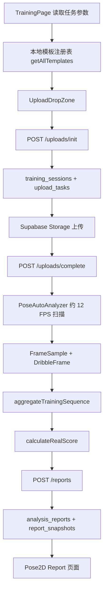

# Training 五个新模板端到端开发计划

## 1. 文档目的

本文档用于指导以下五个新动作模板接入现有 Training 系统：

1. 开合跳
2. 同一侧连续弓步蹲
3. 俯卧撑
4. 单腿站立
5. 双脚基础跳绳

指标定义、建议阈值和儿童反馈文字以 [training-five-template-metrics-development-plan.md](./training-five-template-metrics-development-plan.md) 为准。本文档重点解决端到端开发，包括：

- 前端模板注册与选择。
- MediaPipe 逐帧数据采集。
- 动作片段识别和指标聚合。
- 评分、反馈和报告曲线。
- 后端模板目录、版本和同步。
- 上传会话与模板绑定。
- PostgreSQL 模板及报告关联。
- Coach 任务模板选择。
- 测试、发布和回滚。

本文档基于 `developbranch` 在 2026-07-31 的代码结构编写。

## 2. 范围

### 2.1 本次包含

- 新增五个 Training JSON 模板并注册到前端。
- 保持现有浏览器端 MediaPipe 分析和评分架构。
- 增加五个动作所需的通用几何和时序聚合。
- 将 Training 模板列表连接到后端 `training_templates` 和 `training_template_versions`。
- 保证自由训练、Coach 任务、上传会话和报告使用同一个模板及版本。
- 按指标方案清理现有五个 Training 模板中的时长、次数和速度类评分。
- 增加儿童可读的正向反馈和具体改进建议。
- 增加前端逻辑测试、后端服务测试和端到端验收。

### 2.2 本次不包含

- 后端异步 MediaPipe 或 GPU 分析。
- 三维姿态重建。
- 新训练模型或动作分类神经网络。
- 绳子本身的识别。
- 示例视频制作和上传。
- 按保持秒数、视频总动作次数或标准动作次数评分。
- 给 `training_sessions` 新增模板版本外键。
- 历史报告自动重新评分。

## 3. 当前系统链路

### 3.1 前端现状

- `web/src/config/templates/index.ts` 注册现有五个 Training JSON。
- `web/src/app/pose-2d/training/page.tsx` 只从任务 URL 读取模板，尚未管理自由训练模板选择。
- `PoseWorkspaceShell.tsx` 的 Training 模板列表仍是静态占位内容。
- `UploadDropZone.tsx` 未收到模板时自动选择本地列表第一个模板。
- `PoseAutoAnalyzer.tsx` 以约 12 FPS 扫描视频，最多 420 帧。
- Training 与 Dribbling 共用 `DribbleFrame` 关键点结构。
- `trainingTemporal.ts` 仍使用局部峰谷和固定帧间距识别动作。
- `trainingCalculator.ts` 会输出 `repCount`、`holdDurationSec`、`cadenceSPM` 等不再允许使用的值。
- `calculateRealScore()` 会把缺失指标当成 0 分，并且不区分偏低和偏高建议。
- `MetricTimelineCard.tsx` 对现有五个 Training 模板逐个写了专用分支。
- 已保存报告仍可切换模板并覆盖同一训练会话的报告。

### 3.2 后端与数据库现状

- `training_templates` 已保存模板主信息。
- `training_template_versions` 已保存 JSONB 评分规则、指标定义和 MediaPipe 配置。
- `AdminService.sync_local_training_templates()` 会扫描 `web/src/config/templates/*/*.json`。
- `GET /training-templates` 已可返回数据库模板、版本和示例视频。
- `training_sessions` 已有 `template_code` 和 `template_version` 字段。
- `analysis_reports` 已有字符串 `template_id`、模板外键 `training_template_id` 和 `template_version`。
- `report_snapshots` 已保存每次报告写入时的评分、时间轴和摘要。
- 上传初始化目前不会验证模板是否存在、是否启用或是否与任务一致。
- 报告保存目前允许模板不存在，此时 `training_template_id` 会保存为 `null`。

### 3.3 必须先解决的断点

| 断点 | 当前风险 | 本次处理 |
| --- | --- | --- |
| Training 模板列表是占位 UI | 用户无法可靠选择五个新模板 | 接入数据库目录并与本地可执行模板求交集 |
| 上传端默认取第一个本地模板 | 选择、上传和评分可能不是同一模板 | 页面持有唯一模板上下文并在上传后锁定 |
| 本地同步默认 `local-v1`，上传默认 `v1` | 数据库版本与报告版本漂移 | 所有 Training JSON 显式声明 `version: "v1"` |
| 上传 API 不验证模板 | 会话可保存不存在或停用的模板 | 后端解析并返回规范化模板上下文 |
| 任务模板未在后端校验 | 学生可通过参数替换 Coach 指定模板 | 上传时以任务记录为准并拒绝不一致 |
| 报告可切换模板后覆盖 | 历史报告和任务进度可能被改变 | 已保存报告锁定模板和版本 |
| 缺失 Consistency 被计为 0 | 单次可用动作会被错误扣分 | 缺失分类显示 `N/A` 并重新归一化权重 |
| 固定帧距识别动作 | 长短视频和采样率变化时不稳定 | 使用时间戳、滞回阈值和状态机 |
| 缺失关键点被写成 0 | 0 会污染中位数和稳定性 | 缺失帧跳过，不使用假坐标 |

## 4. 目标架构与关键决策

### 4.1 模板的双层职责

首版不把可执行评分逻辑全部迁到后端：

- 前端本地 JSON 和 TypeScript 聚合函数负责实际计算。
- 数据库负责模板是否发布、当前版本、配置快照和业务关联。
- Training 页面只展示“数据库状态为 active，并且前端有相同 `templateId` 和 `version` 实现”的模板。
- 数据库有记录但前端没有计算实现时，不允许上传。
- 前端有 JSON 但数据库未同步时，不允许作为正式模板使用。

这样可以沿用现有浏览器端评分链路，同时避免显示无法计算或未发布的模板。

### 4.2 唯一模板上下文

从模板选择到报告保存统一使用以下上下文：

| 字段 | 来源 | 用途 |
| --- | --- | --- |
| `templateCode` | 数据库 `template_code` | 选择、上传、评分和报告关联 |
| `templateVersion` | 当前 active/default 版本 | 固定本次评分规则 |
| `templatePublicId` | 数据库模板 | 前后端管理关联 |
| `templateVersionPublicId` | 数据库版本 | 运行时校验和审计 |
| `contentHash` | 同步生成的 JSON 哈希 | 检查数据库与前端配置是否一致 |
| `camera` | 模板 JSON | 显示正面或侧面拍摄要求 |
| `runtimeTemplate` | 前端本地 JSON | 实际执行聚合和评分 |

上传成功后必须锁定该上下文，不能在分析页或报告页静默切换。

### 4.3 数据库迁移决策

本次新增五个模板不需要新建数据库表，也不需要修改现有表结构：

- 新模板通过 `sync-local` 写入 `training_templates`。
- 每个模板的 `v1` 规则写入 `training_template_versions`。
- 上传会话继续保存 `template_code` 和 `template_version`。
- 报告继续保存 `training_template_id` 外键和版本字符串。

只有未来需要把会话直接关联到 `training_template_versions.id` 时，再单独设计 Alembic 迁移。

### 4.4 报告不可静默重算

- 已保存报告以 `score_data` 中的原始评分结果为准。
- 报告页使用保存时的 `template_code` 和 `template_version`。
- 模板选择器在已保存报告中改为只读信息。
- 未来若需要重新评分，应建立显式“重新分析”流程和新快照，不能覆盖原结果。

### 4.5 时长与次数只属于分析诊断

- 帧数、采样覆盖率和时间戳可用于判断数据是否足够。
- 动作片段数量可在内存中用于决定 Consistency 是否可计算。
- 这些值不作为评分指标，不进入儿童可见的发现卡片。
- 报告不展示保持秒数、标准动作次数、达标次数或问题动作比例。

## 5. 五个模板注册清单

| 动作 | Template ID | 拍摄方向 | Posture | Execution | Consistency |
| --- | --- | --- | --- | --- | --- |
| 开合跳 | `jumping_jack_reps_front` | 正面 | 躯干直立、落地膝对齐 | 双脚展开、手臂高度 | 展开幅度、节奏 |
| 同侧弓步蹲 | `lunge_same_side_reps_side` | 侧面 | 躯干前倾、前膝位置 | 前膝深度、后膝深度 | 深度、节奏 |
| 俯卧撑 | `pushup_reps_side` | 侧面 | 身体直线 | 底部深度、顶部伸肘 | 深度、身体线 |
| 单腿站立 | `single_leg_stand_front` | 正面 | 骨盆水平、躯干直立 | 抬脚高度、支撑膝控制 | 身体晃动、骨盆稳定 |
| 双脚基础跳绳 | `jump_rope_basic_front` | 正面 | 躯干直立、肘部位置 | 双脚同步、跳跃高度 | 高度、节奏 |

所有模板使用：

- `mode: "training"`
- `version: "v1"`
- `categoryWeights: 0.4 / 0.4 / 0.2`
- 每个维度 1-2 个指标
- `range`、`target`、`boolean` 或现有 `rangeByOption` 评分类型
- 不包含时长、动作总数或标准动作数指标

## 6. 配置与数据契约

### 6.1 本地 JSON 模板

修改 `ActionTemplate` 和 `Metric` 类型，使每个模板明确包含：

| 字段 | 要求 |
| --- | --- |
| `version` | 必填，首版统一为 `v1` |
| `templateId` | 必须与数据库 `template_code` 完全一致 |
| `mode` | 必须为 `training` |
| `camera` | `front` 或 `side` |
| `displayName` | 儿童可理解的动作名称 |
| `categoryWeights` | Posture、Execution、Consistency 权重 |
| `metricId` | 模板内唯一 |
| `displayName` | 儿童可读指标名称 |
| `computeKey` | 与聚合函数输出完全一致 |
| `targetText` | 简单目标文字，不显示公式 |
| `hint_good` | 做得好的具体反馈 |
| `hint_low` | 实际值偏低时的建议 |
| `hint_high` | 实际值偏高时的建议 |

兼容现有 `hint_bad` 一段时间，但五个新模板和本次清理后的现有模板必须使用方向明确的反馈字段。

### 6.2 聚合结果

`aggregateTrainingSequence()` 不再只返回松散数值字典，改为返回：

| 字段 | 说明 |
| --- | --- |
| `metrics` | 可参与评分的聚合指标 |
| `analysisStatus` | `ready` 或 `insufficient_data` |
| `missingRequiredKeys` | 缺失的 Posture/Execution 指标 |
| `consistencyAvailable` | 是否有足够片段评价稳定性 |
| `cameraMatch` | 拍摄方向是否符合建议 |
| `reason` | 数据不足或方向错误的内部原因 |

结果不得包含 `repCount`、`holdDurationSec`、`goodFormFrameRatio`、`cadenceSPM` 或其他次数/时长评分字段。

### 6.3 评分发现项

扩展 `Finding`：

| 字段 | 说明 |
| --- | --- |
| `title` | 儿童可读指标名称 |
| `actualValue` | 格式化后的实际表现 |
| `targetText` | 简单目标 |
| `state` | `good`、`low`、`high` 或 `missing` |
| `hint` | 对应状态的表扬或建议 |
| `score` | 单项 0-100 分 |
| `category` | Posture、Execution 或 Consistency |

缺失 Consistency 指标不计 0 分。若 Posture 或 Execution 的必要指标缺失，则整体状态为数据不足，不生成误导性总分。

### 6.4 后端模板目录

`GET /training-templates` 增加可选 `analysis_type` 查询参数。Training 页面请求：

- `analysis_type=training`
- 默认只返回 `status=active` 的模板
- 只返回 active 版本，或至少明确 current/default active 版本

前端根据 `template_code + version + content_hash` 与本地模板进行匹配。

### 6.5 上传初始化响应

扩展 `UploadInitResponse` 和前端 `CompletedUploadSession`，返回后端确认后的：

- `template_code`
- `template_version`
- `template_public_id`
- `template_version_public_id`
- `template_content_hash`

后续分析和报告保存只使用该响应，不再重新从 URL 或默认列表推断模板。

## 7. 分阶段开发计划

### 阶段 0：建立基线与测试能力

#### 目标

在改动评分前固定当前行为，并为时序算法增加可重复测试入口。

#### 任务

- 保存现有五个 Training 模板的测试输出基线。
- 从测试视频导出匿名化关键点序列，避免把大型或儿童原始视频提交到仓库。
- 为开合跳、弓步蹲、俯卧撑、单腿站立和跳绳各准备：
  - 一份动作基本正确序列。
  - 一份包含主要错误的序列。
  - 一份动作不完整或关键点缺失的序列。
- 在 `web/package.json` 增加 Vitest 测试命令。
- 建立 Training 时序、聚合和评分测试目录。

#### 建议文件

- `web/package.json`
- `web/src/lib/__tests__/trainingTemporal.test.ts`
- `web/src/lib/__tests__/trainingCalculator.test.ts`
- `web/src/lib/__tests__/scoring.test.ts`
- `web/src/lib/__fixtures__/training/*.json`

#### 完成标准

- 测试可在不启动浏览器和 MediaPipe 的情况下运行。
- 测试数据只包含归一化关键点或派生数值。
- 现有五个模板的保留指标有基线断言。

### 阶段 1：统一模板 Schema、版本和本地注册

#### 目标

先让十个 Training 模板拥有一致且可同步的配置结构。

#### 任务

- 在 `ActionTemplate` 中增加必填 `version`。
- 在 `Metric` 中增加儿童可读名称、目标和方向反馈字段。
- 为现有五个 Training JSON 增加显式 `version: "v1"`。
- 新增五个模板 JSON。
- 在 `web/src/config/templates/index.ts` 注册五个新模板。
- 增加模板启动校验：
  - Template ID 不重复。
  - Metric ID 不重复。
  - `computeKey` 非空。
  - 每个分类的指标权重和为 1。
  - 分类权重和为 1。
- 同步执行现有模板清理：
  - 删除 `repTarget`、`targetDurationSec` 和 `targetHoldSec`。
  - 删除 `repTempoSec`、`cadenceSPM`、`holdDurationSec` 和 `goodFormFrameRatio` 的模板引用。
  - 按指标方案调整现有五个模板的 Execution 指标。

#### 新增文件

- `web/src/config/templates/training/jumping_jack_reps_front.json`
- `web/src/config/templates/training/lunge_same_side_reps_side.json`
- `web/src/config/templates/training/pushup_reps_side.json`
- `web/src/config/templates/training/single_leg_stand_front.json`
- `web/src/config/templates/training/jump_rope_basic_front.json`

#### 修改文件

- `web/src/config/templates/index.ts`
- `web/src/config/templates/training/deep_squat_reps_side.json`
- `web/src/config/templates/training/high_knees_in_place_side.json`
- `web/src/config/templates/training/pushup_hold_high_plank.json`
- `web/src/config/templates/training/wall_sit_half_hold.json`
- `web/src/config/templates/training/wall_sit_quarter_hold.json`

#### 完成标准

- `getAllTemplates("training")` 返回十个唯一模板。
- 所有 Training 模板版本均为 `v1`。
- JSON 中不存在时长、总次数和标准次数评分。
- 每项指标都有具体的正向和改进反馈。

### 阶段 2：重构 Training 关键点和时序基础层

#### 目标

建立五个新模板可以共同使用的双侧几何和稳定动作分段能力。

#### 任务

- 将 Training 逻辑从“选择可见的一侧”扩展为保留左右肩、肘、腕、髋、膝、踝和脚尖。
- 可继续复用 `DribbleFrame` 的字段，但增加 Training 专用类型别名和校验函数，避免业务语义混乱。
- 新增通用几何：
  - 三点关节角。
  - 点到线距离。
  - 肩宽、躯干长和腿长归一化。
  - 身体中点。
  - 躯干相对垂直角。
  - 骨盆相对水平角。
- 所有几何函数遇到低可见性或零尺度时返回 `undefined`，不返回 0。
- 将 `detectRepetitions()` 替换为基于时间戳的状态机：
  - 使用进入和退出两个阈值形成滞回。
  - 使用秒数而不是固定帧数限制状态抖动。
  - 支持视频从动作中间开始。
  - 忽略视频结尾未结束的片段。
  - 允许短暂关键点缺失。
- `calculateStdDev()` 和相对波动函数在样本不足时返回 `undefined`。
- 摄像方向检测只作为提示，不进入动作得分。

#### 建议文件

- `web/src/lib/trainingTemporal.ts`
- `web/src/lib/trainingGeometry.ts`
- `web/src/lib/dribbleTemporal.ts`
- `web/src/components/Pose2D/poseMetrics.ts`
- `web/src/components/Pose2D/PoseAutoAnalyzer.tsx`

#### 完成标准

- 分段结果不依赖视频固定 FPS。
- 缺失关键点不会形成 0 度、0 距离或完美稳定性。
- 单个可评估动作仍可计算 Posture 和 Execution。
- Consistency 样本不足时明确为不可用。

### 阶段 3：实现五个模板的分段和指标聚合

#### 目标

按照指标文档实现五个独立但共享基础工具的聚合器。

#### 任务

- 为每个模板实现一个明确的聚合函数。
- 使用 `templateId` 分派到对应聚合器，不在一个大函数中堆叠大量条件。
- 重复动作先计算每个可评估片段的内部质量，再取中位数。
- 单腿站立选择关键点最完整的可用片段，仅评价姿态和稳定性。
- Consistency 只在数据足够时输出。
- 不向评分结果输出片段数量、保持时长或动作次数。

#### 建议函数

| 模板 | 聚合函数 |
| --- | --- |
| 开合跳 | `aggregateJumpingJack()` |
| 同侧弓步蹲 | `aggregateSameSideLunge()` |
| 俯卧撑 | `aggregatePushupReps()` |
| 单腿站立 | `aggregateSingleLegStand()` |
| 双脚基础跳绳 | `aggregateBasicJumpRope()` |

#### 建议文件

- `web/src/lib/trainingCalculator.ts`
- `web/src/lib/trainingAggregators.ts`
- `web/src/lib/trainingTemporal.ts`
- `web/src/components/Pose2D/poseMetrics.ts`

#### 完成标准

- 每个模板输出的 `computeKey` 与 JSON 完全一致。
- 正确样例的必要指标全部可用。
- 主要错误样例能反映为对应指标偏低或偏高。
- 视频较长或动作重复更多不会自动获得更高质量分。
- 约 12 FPS 下的快速跳绳数据不足时显示不可评分，而不是生成错误高分。

### 阶段 4：评分、反馈和报告展示

#### 目标

让评分正确处理缺失数据，并让儿童看到具体、易懂的反馈。

#### 任务

- 修改 `calculateRealScore()`：
  - 返回实际值、目标文字和 `good/low/high/missing`。
  - 按偏低或偏高选择不同建议。
  - 缺失指标不加入分类分母。
  - 整个 Consistency 不可用时，从总分权重中移除并重新归一化。
  - 必要 Posture 或 Execution 缺失时不生成总分。
- 修改报告发现卡：
  - 使用 `Metric.displayName`，不再由 Metric ID 自动生成标题。
  - 显示实际表现和简单目标。
  - 显示具体表扬或动作建议。
  - 不显示 computeKey、CV、标准差或公式。
- 将 Training 曲线改为数据驱动：
  - 从模板指标生成标题、目标区间和单位。
  - 对逐帧指标显示时间曲线。
  - 对聚合稳定性指标显示摘要，不制造不存在的时间曲线。
- 把 Training 专用展示从 3000 行的 `MetricTimelineCard.tsx` 中拆分，避免继续增加五组硬编码分支。
- 已保存 Training 报告锁定模板和版本，移除自动重算和自动覆盖。

#### 建议文件

- `web/src/lib/scoring.ts`
- `web/src/components/Pose2D/MetricTimelineCard.tsx`
- `web/src/components/Pose2D/TrainingMetricTimelineCard.tsx`
- `web/src/app/pose-2d/report/page.tsx`
- `web/src/store/analysisStore.ts`

#### 完成标准

- 一次可评估动作不会因为没有 Consistency 被判 0 分。
- 低于目标和高于目标显示不同建议。
- 每个新模板至少有一条正向反馈和一条具体改进反馈。
- 已保存报告刷新后得分、模板和版本保持不变。

### 阶段 5：后端模板同步和会话校验

#### 目标

让数据库成为发布与版本目录，并保证会话和报告不能脱离该目录。

#### 任务

- 为本地 JSON 解析增加后端校验：
  - `templateId`、`version`、`mode`、`camera` 必填。
  - Training 模板必须有 Posture 和 Execution 指标。
  - Metric ID 和 computeKey 不能为空。
  - 不允许时长和次数类禁用 computeKey。
- 保留现有内容哈希和幂等同步逻辑。
- 给 `GET /training-templates` 增加 `analysis_type` 过滤。
- 学生模板 API 只暴露 active 模板和可用版本。
- 修改上传初始化：
  - Training 上传必须有模板。
  - 验证模板存在、active 且 `analysis_type=training`。
  - 未传版本时使用数据库当前 active/default 版本。
  - 传入版本时验证版本属于模板且 active。
  - Coach 任务上传时，以任务模板为准并拒绝篡改。
  - 将规范化后的模板和版本写入 `training_sessions`。
  - 在响应中返回规范化模板上下文。
- 修改报告保存：
  - Training 报告的模板必须存在。
  - 报告模板和版本必须与训练会话一致。
  - `training_template_id` 必须非空。
  - 不允许通过重复保存把同一会话改成其他模板。

#### 修改文件

- `server/app/services/admin_service.py`
- `server/app/services/template_service.py`
- `server/app/services/training_service.py`
- `server/app/services/report_service.py`
- `server/app/api/v1/training_templates.py`
- `server/app/schemas/template.py`
- `server/app/schemas/training.py`
- `server/app/schemas/report.py`
- `web/src/services/templates.ts`
- `web/src/services/uploads.ts`

#### 数据库操作

本阶段不新增 Alembic migration。开发和部署时按以下顺序操作：

1. Admin 模板页执行 `Dry run`。
2. 确认五个新模板为 create，现有模板规则调整为 update。
3. 执行 `Sync local`。
4. 再次执行 `Dry run`，所有项目应为 skip。
5. 检查五个新 `training_templates` 记录均为 active。
6. 检查每个模板存在一个 active/default `v1`。
7. 检查 JSONB 中的 `content_hash`、camera 和 metric count。

#### 完成标准

- 同步重复执行不会创建重复模板或版本。
- API 能按 Training 返回十个 active 模板。
- 新报告的 `training_template_id` 非空。
- 会话、报告和报告快照的版本均为 `v1`。
- 篡改模板代码或版本会得到明确的 4xx 响应。

### 阶段 6：Training 前端模板选择与上传锁定

#### 目标

让用户在上传前明确选择动作，并让选择贯穿整个分析链路。

#### 任务

- 新增 Training 模板目录 Hook：
  - 请求数据库 Training 模板。
  - 与本地 `getAllTemplates("training")` 按 code、version 和 hash 匹配。
  - 输出可用、未同步和版本不匹配状态。
- 新增真正可操作的 `TrainingTemplatePicker`：
  - 显示十个 Training 模板。
  - 显示正面或侧面拍摄徽标。
  - 显示一句拍摄要求。
  - 不使用静态占位按钮。
- 自由训练：
  - 用户必须先选择模板。
  - 所选模板传入上传初始化。
- Coach 任务：
  - 从任务参数加载模板。
  - 后端再次校验。
  - 选择器显示锁定状态，不能切换。
- 上传开始后锁定模板，清除视频后才允许重新选择。
- `UploadDropZone` 不再自行选择本地列表第一个模板。
- `PoseAnalysisView` 只使用 `CompletedUploadSession` 返回的规范化模板上下文。
- 更新 Training 工作区的静态文字和模板数量。
- Coach 创建任务的模板下拉框改用数据库 active 模板目录，避免分配停用模板。

#### 建议文件

- `web/src/app/pose-2d/training/page.tsx`
- `web/src/components/Pose2D/PoseWorkspaceShell.tsx`
- `web/src/components/Pose2D/TrainingTemplatePicker.tsx`
- `web/src/components/Pose2D/UploadDropZone.tsx`
- `web/src/components/Pose2D/PoseAnalysisView.tsx`
- `web/src/hooks/useTrainingTemplateCatalog.ts`
- `web/src/components/coach/CreateTaskPanel.tsx`
- `web/src/components/coach/coachUtils.ts`
- `web/src/services/templates.ts`
- `web/src/services/uploads.ts`

#### UI 状态

| 状态 | 行为 |
| --- | --- |
| Loading | 保持选择器尺寸稳定，显示加载状态 |
| Ready | 显示数据库和本地均可用的模板 |
| Task locked | 显示任务指定模板，不允许切换 |
| Unsynced | 禁止上传，提示管理员同步模板 |
| Version mismatch | 禁止上传，提示刷新部署或重新同步 |
| Uploaded | 模板锁定，清除视频后可重新选择 |
| API error | 不静默退回第一个模板，显示重试 |

#### 完成标准

- 自由训练可以选择任意一个 active 新模板。
- 正面和侧面要求在上传前可见。
- 上传会话中的模板与页面选择完全一致。
- 任务入口不能切换 Coach 指定模板。
- 后端目录不可用时不会错误上传为第一个模板。

### 阶段 7：报告、个人中心、Coach 和 Admin 联调

#### 目标

确保新模板在报告和业务工作流中完整可见。

#### 任务

- 报告页按保存的模板显示名称、版本、指标和曲线。
- 个人中心报告列表能通过本地注册表显示五个新模板名称。
- Coach 报告列表能显示新模板名称。
- Coach 可创建五个新模板的 Training 任务。
- 学生从任务进入后模板正确锁定。
- Admin 模板页可看到五个新模板、版本和同步结果。
- 模板被设置为 inactive 后：
  - 新自由训练不再显示。
  - 新 Coach 任务不能选择。
  - 旧报告仍可查看。

#### 建议文件

- `web/src/app/pose-2d/report/page.tsx`
- `web/src/app/me/page.tsx`
- `web/src/components/coach/CreateTaskPanel.tsx`
- `web/src/components/coach/CoachReportTable.tsx`
- `web/src/components/coach/coachUtils.ts`
- `web/src/app/admin/templates/page.tsx`

#### 完成标准

- 新模板名称不以原始 code 形式出现在正常 UI。
- 旧报告不依赖模板当前是否 active。
- 同一训练会话只能关联一个模板和版本。
- Coach 任务完成统计只使用匹配模板的报告。

### 阶段 8：验证、发布与回滚

#### 自动验证

前端：

- `npm run test`
- `npm run lint`
- `npm run build`

后端：

- `python -m unittest discover -s tests -p "test_*.py"`
- `python -m compileall app`
- `alembic upgrade head`

仓库：

- `git diff --check`
- JSON 解析和模板唯一性检查
- 禁用 computeKey 扫描

#### 后端测试矩阵

| 场景 | 预期 |
| --- | --- |
| sync-local 首次 dry-run | 五个新模板显示 create |
| sync-local apply 后再次 dry-run | 全部显示 skip |
| Training 模板列表 | 只返回 active Training 模板 |
| 上传未传模板 | 4xx |
| 上传传入 inactive 模板 | 4xx |
| 上传传入错误 analysis type | 4xx |
| 任务模板与请求不一致 | 4xx |
| 未传版本 | 后端返回当前 active/default 版本 |
| 报告模板与会话不一致 | 4xx |
| 正常保存新模板报告 | `training_template_id` 非空 |
| 同会话重复保存相同模板 | 更新同一报告并新增快照 |

#### 前端逻辑测试矩阵

| 场景 | 预期 |
| --- | --- |
| 视频从动作中间开始 | 不把前半段当完整片段 |
| 视频以半个动作结束 | 不污染聚合值 |
| 关键点短暂丢失 | 跳过缺失帧 |
| 只有一个可评估动作 | Posture/Execution 可用，Consistency 为 N/A |
| 相同动作重复较多 | 不因次数更多提高质量分 |
| 相同单腿姿态片段长短不同 | 得分接近 |
| 正面模板上传侧面视频 | 给拍摄方向提示 |
| 快速跳绳采样不足 | 数据不足，不生成错误高分 |
| 指标偏低 | 使用 `hint_low` |
| 指标偏高 | 使用 `hint_high` |
| 已保存报告刷新 | 分数、模板和版本不变 |

#### 五模板人工验收

每个模板至少用一段基本正确视频和一段典型错误视频验证：

| 模板 | 正确视频重点 | 错误视频重点 |
| --- | --- | --- |
| 开合跳 | 正面、双手双脚完整、膝盖对齐 | 脚距不足、手臂低、落地膝偏 |
| 同侧弓步蹲 | 侧面、同一侧连续、前后膝下降 | 深度不足、身体前倾、未回顶部 |
| 俯卧撑 | 侧面、身体直线、底部和顶部完整 | 浅俯卧撑、塌腰、顶部未伸直 |
| 单腿站立 | 正面、骨盆水平、支撑膝稳定 | 身体侧歪、膝偏、骨盆晃动 |
| 双脚基础跳绳 | 正面、双脚同步、轻快小跳 | 双脚不齐、跳太高、肘部张开 |

#### 发布顺序

1. 合并前端聚合、评分和后端校验代码。
2. 在测试环境运行全部自动测试。
3. 在测试环境执行 Admin dry-run 和 sync。
4. 完成五模板人工视频验收。
5. 部署后端。
6. 执行生产 Admin dry-run。
7. 确认结果后执行生产 sync。
8. 部署前端。
9. 验证自由训练、Coach 任务和已保存报告。

#### 回滚

- 前端异常：回滚前端部署版本。
- 某个模板异常：在 Admin 将该模板状态改为 inactive。
- 规则异常：恢复上一版本 JSON，重新部署并执行 sync-local。
- 报告保存异常：停止新模板入口，不删除已生成报告或快照。
- 不通过删除数据库模板记录进行回滚，避免破坏历史报告外键。

## 8. 文件影响清单

### 8.1 前端主要修改

- `web/src/config/templates/index.ts`
- `web/src/config/templates/training/*.json`
- `web/src/app/pose-2d/training/page.tsx`
- `web/src/app/pose-2d/report/page.tsx`
- `web/src/components/Pose2D/PoseWorkspaceShell.tsx`
- `web/src/components/Pose2D/UploadDropZone.tsx`
- `web/src/components/Pose2D/PoseAutoAnalyzer.tsx`
- `web/src/components/Pose2D/PoseAnalysisView.tsx`
- `web/src/components/Pose2D/poseMetrics.ts`
- `web/src/components/Pose2D/MetricTimelineCard.tsx`
- `web/src/lib/trainingTemporal.ts`
- `web/src/lib/trainingCalculator.ts`
- `web/src/lib/scoring.ts`
- `web/src/services/templates.ts`
- `web/src/services/uploads.ts`
- `web/src/services/reports.ts`
- `web/src/components/coach/CreateTaskPanel.tsx`

### 8.2 建议新增前端文件

- `web/src/components/Pose2D/TrainingTemplatePicker.tsx`
- `web/src/components/Pose2D/TrainingMetricTimelineCard.tsx`
- `web/src/hooks/useTrainingTemplateCatalog.ts`
- `web/src/lib/trainingGeometry.ts`
- `web/src/lib/trainingAggregators.ts`
- `web/src/lib/__tests__/trainingTemporal.test.ts`
- `web/src/lib/__tests__/trainingCalculator.test.ts`
- `web/src/lib/__tests__/scoring.test.ts`

### 8.3 后端主要修改

- `server/app/api/v1/training_templates.py`
- `server/app/schemas/template.py`
- `server/app/schemas/training.py`
- `server/app/schemas/report.py`
- `server/app/services/template_service.py`
- `server/app/services/admin_service.py`
- `server/app/services/training_service.py`
- `server/app/services/report_service.py`

### 8.4 建议新增后端测试

- `server/tests/test_template_sync_service.py`
- `server/tests/test_training_template_binding.py`

### 8.5 文档修改

- `docs/api-spec.md`
- `docs/training-five-template-metrics-development-plan.md`
- 本文档

## 9. 开发检查点

建议后续开发按以下检查点分批提交，不一次完成全部改动：

### Checkpoint A：模板与测试骨架

- 十个 Training JSON 通过 Schema 校验。
- 五个新模板已注册但尚不开放上传。
- 测试命令可运行。

### Checkpoint B：时序与指标

- 五个聚合器通过关键点 fixture 测试。
- 无时长、次数和正确帧比例输出。
- 单次动作 Consistency 为 N/A。

### Checkpoint C：评分与报告

- 正向、偏低、偏高和缺失反馈正确。
- 已保存报告不再切换模板重写。
- 五个模板报告展示可用。

### Checkpoint D：后端绑定

- 模板目录、版本、上传和报告校验通过。
- sync-local 幂等。
- 新报告外键完整。

### Checkpoint E：前端业务联调

- 自由训练选择可用。
- Coach 任务锁定可用。
- Admin、Coach、个人中心和报告显示一致。

### Checkpoint F：发布

- 自动测试、构建和人工视频验收全部通过。
- 生产 dry-run 结果符合预期。
- 具备按模板 inactive 的回滚能力。

## 10. 最终验收清单

- [ ] 五个新模板都在 Training 选择器中显示。
- [ ] 新增后 Training 模板总数为十个。
- [ ] 每个模板显示正确的正面或侧面拍摄要求。
- [ ] 自由训练选择的模板与上传会话一致。
- [ ] Coach 任务模板不可被学生切换。
- [ ] 数据库存在五个新模板和五个 active/default `v1`。
- [ ] 新报告的 `training_template_id` 非空。
- [ ] 报告模板和版本与训练会话一致。
- [ ] 已保存报告不能通过切换模板静默重写。
- [ ] 五个新模板均可识别可评估动作片段。
- [ ] 每个模板的 Posture、Execution 和 Consistency 输出符合指标文档。
- [ ] 单次可评估动作的 Consistency 显示 N/A。
- [ ] 所有报告都有实际表现、简单目标和具体反馈。
- [ ] 报告不显示 CV、标准差、computeKey 或公式。
- [ ] 所有模板均不按保持时长、视频总时长或动作次数评分。
- [ ] 现有五个 Training 模板中的禁用指标已清理。
- [ ] API、服务、时序、评分和构建验证全部通过。
- [ ] Admin dry-run、sync 和二次 dry-run 结果正确。
