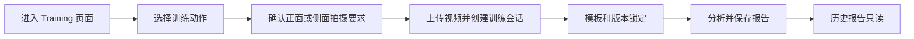

# Training 五模板下一阶段状态、风险与开发计划

更新日期：2026-08-01  
适用分支：`developbranch` 当前工作区  
关联文档：

- [training-five-template-end-to-end-development-plan.md](./training-five-template-end-to-end-development-plan.md)
- [training-five-template-metrics-development-plan.md](./training-five-template-metrics-development-plan.md)

## 1. 文档目的

本文档回答以下问题，并作为下一阶段开发和上线前验收依据：

1. 原有五个 Training 模板的评分现在修改成了什么。
2. 五个运球模板是否被修改，以及共享评分器是否带来间接影响。
3. Training 报告不能切换模板后，用户应该在哪里选择训练动作。
4. 新增五个模板是否需要修改数据库，是否需要新增 Alembic migration。
5. 当前已经完成什么、尚未完成什么、下一步先做什么。
6. 当前系统有哪些功能风险、数据风险和安全风险。

## 2. 结论先行

### 2.1 原五个 Training 模板不只是删除指标

此前“保留全部有效指标，只删除禁用项”的表述过于简化。当前代码还包含以下有意调整：

- 删除时长、次数、绝对速度和正确帧比例评分。
- 重新分配被删除指标留下的同分类权重。
- 将墙靠静蹲的膝角深度从 Posture 调整为 Execution。
- 将前臂平板支撑的支撑肘角从 Posture 调整为 Execution，并把目标改为肩膀位于约 90 度肘部正上方。
- 所有 Training 模板统一使用 `Posture 40% + Execution 40% + Consistency 20%`。
- 一次完整动作可以评价 Posture 和 Execution；Consistency 数据不足时显示 `N/A`，并将总分权重重新归一化。

### 2.2 运球模板配置没有直接修改，但共享评分行为有变化

当前工作区没有修改以下文件或运球时序聚合器：

- `web/src/config/templates/dribbling/*.json`
- `web/src/lib/dribbleCalculator.ts`
- `web/src/lib/dribbleTemporal.ts`

因此五个运球模板的指标、目标值、容差和指标权重没有直接改动。

但是 `web/src/lib/scoring.ts` 是 Shooting、Dribbling 和 Training 共用评分器，本轮已经重构，所以存在间接行为变化：

- 缺失指标不再自动按 0 分计入分类平均值。
- 缺失分类会重新归一化总分权重。
- Posture 或 Execution 整个分类缺失时不生成有效总分。
- 反馈从单一 `hint_bad` 扩展为 `good / low / high / missing`。
- 数值在目标区间外但仍得到较高分时，报告会显示改进建议，而不再误标为“做得好”。

在所有运球指标都正常采集时，`target`、`range` 和 `rangeByOption` 的核心数值公式与旧版本基本一致。但是目前还没有覆盖五个运球模板的固定输入、固定输出 golden tests，因此不能声称运球评分结果已经被证明完全无回归。

### 2.3 Training 模板应该在上传前选择

当前设计不是在历史报告页重新选择模板，而是：



- 自由训练：在上传区上方的模板卡片中选择动作。
- Coach 任务：模板由任务指定，用户不能替换。
- 上传完成后：模板随上传会话锁定，避免分析和报告使用不同动作规则。
- 清除当前视频后：返回模板选择区，可以选择其他动作并重新上传。
- 已保存报告：不能切换模板后覆盖原报告。

当前尚未实现“同一视频显式选择另一个动作并创建一份新分析”的流程。若产品需要该能力，应增加“使用其他模板重新分析”命令，并创建新的上传会话和新报告，不能修改历史报告。

### 2.4 需要同步数据库数据，但当前不需要新增 Alembic migration

数据库表已经由以下现有 migration 创建：

- `server/alembic/versions/20260427_0002_training_camp_core.py`
- 表：`training_templates`
- 表：`training_template_versions`
- `training_sessions` 已有 `template_code` 和 `template_version`
- `analysis_reports` 已有 `training_template_id` 和 `template_version`

本轮没有新增或修改数据库列、索引或约束，因此：

- 不需要为五个新模板创建新的 Alembic revision。
- 需要把模板 JSON 作为业务数据同步到现有表。
- 如果目标数据库还没有应用 `20260427_0002`，则需要执行已有 migration 到 `head`，这不等于为本功能新增 migration。

数据同步入口：

- Admin 页面：`/admin/templates`
- 预览：`POST /api/v1/admin/training-templates/sync-local?dry_run=true`
- 应用：`POST /api/v1/admin/training-templates/sync-local?dry_run=false`

正式应用前必须先处理第 8.3 节的版本覆盖风险。

### 2.5 评分指标和图表必须按版本一一对应

指标新增或删除后，对应图表必须同步新增或删除，但判断依据不是“当前代码里有哪些图表”，而是“这份报告锁定版本的 JSON 定义了哪些指标”。

硬性规则：

- 每个模板指标对应一个 Finding、一张评分卡和一张图表或聚合摘要。
- 三者数量和顺序都等于锁定版本 `metrics` 数组。
- 图表评分目标区间直接读取同一指标的 `target/tol` 或 `L/U`：`target ± tol` 保持现有 90-100 分规则，`[L,U]` 保持现有 100 分规则。
- 历史报告使用保存时的模板快照；当前 JSON 更新不能改变历史报告的指标或图表。
- 指标缺失时显示 `N/A` 图表，不能直接少画一张。

截图中的深蹲报告显示 `7 Checks`，但 Performance Curves 只有 `6` 张。原因是 Findings 来自包含 `Rep Rhythm` 的旧保存结果，而图表来自已经删除该指标的当前模板代码。这是确认存在的版本混用问题，不是单纯的计数样式问题。

## 3. 当前统一评分公式

### 3.1 Range 指标

目标区间为 `[L, U]`，区间外缓冲距离为 `margin`：

```text
L <= x <= U: score = 100
x < L:        score = max(0, 100 - 100 * (L - x) / margin)
x > U:        score = max(0, 100 - 100 * (x - U) / margin)
```

### 3.2 Target 指标当前实现（保持不变）

目标为 `T`，容差为 `tol`，容差外缓冲为 `margin`：

```text
d = abs(x - T)

d <= tol:
score = 100 - 10 * d / tol

d > tol:
score = max(0, 90 - 90 * (d - tol) / margin)
```

因此目标点为 100 分，`target ± tol` 是 90-100 分目标区间，容差边缘为 90 分；超出该区间后继续按 `margin` 线性降分。下一阶段不得修改这一定义，也不得借图表改造改变旧 Training、Shooting 或 Dribbling 的发布结果。

### 3.3 图表评分目标区间解析规则

评分器和图表必须共用一个 resolver，输入为锁定版本 Metric 与评分上下文，输出至少包括目标区间上下界、目标点、区间内分数语义和降分边界。

| JSON 指标 | 图表目标区间 | 现有评分语义 |
| --- | --- | --- |
| `type: range` | `[L,U]` | 区间内 100 分；`margin` 仅为区间外降分距离 |
| `type: target` | `[target-effectiveTol, target+effectiveTol]` | 区间内 90-100 分，越接近 `target` 越接近 100 分 |
| `type: rangeByOption` | 当前 option 对应的 `[L,U]` | 区间内 100 分；使用对应 option 的 `margin` |

禁止在 `MetricTimelineCard.tsx` 或专用模板组件中再次手写目标区间。图表目标带、Finding 的目标文本和评分器必须使用同一次参数解析结果；图表展示不能反向改变评分公式。

### 3.4 分类与总分

1. 每个分类内部按模板中的指标权重计算加权平均。
2. 正常情况下总分为：

```text
Overall = Posture * 0.40 + Execution * 0.40 + Consistency * 0.20
```

3. 一次完整动作导致 Consistency 不可用时：

```text
Overall = Posture * 0.50 + Execution * 0.50
Consistency = N/A
```

4. 如果 Posture 或 Execution 整个分类没有可用指标，则 `analysisStatus = insufficient_data`，不生成可用总分。
5. 年龄容差配置仍会对 `tol` 和 `margin` 应用倍率。

## 4. 原有五个 Training 模板现在的评分

### 4.1 Bodyweight Squat，侧面

| 分类 | 当前指标 | 目标 | 分类内权重 |
| --- | --- | --- | ---: |
| Posture | Chest Position | 躯干前倾 `0-45°` | 0.50 |
| Posture | Knee Position | 膝盖相对脚尖偏移 `-0.05-0.15` | 0.50 |
| Execution | Squat Depth | 髋部相对膝线目标 `-0.20 ± 0.32` | 0.50 |
| Execution | Top Position | 顶部膝角 `175° ± 10°` | 0.50 |
| Consistency | Repeatable Squat Depth | 深度波动目标 `0.03 ± 0.02` | 0.50 |
| Consistency | Stable Chest Position | 躯干角波动目标 `4° ± 2°` | 0.50 |

已删除：

- `repTempoSec`
- 按单次动作耗时评价 Execution

权重变化：Execution 从“深度 0.60、顶部 0.20、节奏 0.20”调整为“深度 0.50、顶部 0.50”；Consistency 调整为两个保留指标各 0.50。

### 4.2 High Knees，侧面

| 分类 | 当前指标 | 目标 | 分类内权重 |
| --- | --- | --- | ---: |
| Posture | Upright Body | 躯干 `0° ± 12°` | 0.50 |
| Posture | Foot Landing Position | 脚落在髋部下方 `-0.10-0.10` | 0.50 |
| Execution | Knee Lift Height | 膝盖接近髋高，比例 `1.00 ± 0.20` | 1.00 |
| Consistency | Repeatable Knee Height | 抬膝高度波动 `0.30 ± 0.10` | 0.50 |
| Consistency | Steady Step Rhythm | 相邻动作节奏变化 `0.20 ± 0.10` | 0.50 |

已删除：

- `cadenceSPM`
- 每分钟步数或固定速度目标

保留的 Steady Step Rhythm 只评价相邻动作是否忽快忽慢，不评价动作必须达到某个绝对速度。报告不显示 `CV` 术语。

### 4.3 Forearm Plank，侧面

| 分类 | 当前指标 | 目标 | 分类内权重 |
| --- | --- | --- | ---: |
| Posture | Straight Body Line | 肩、髋、踝身体线 `172° ± 8°` | 1.00 |
| Execution | Support Elbow Angle | 肩膀位于约 90 度肘部上方，`90° ± 10°` | 1.00 |
| Consistency | Body Stability | 身体线角度波动 `3° ± 2°` | 1.00 |

已删除：

- `goodFormFrameRatio`
- Shoulder Stack 独立评分
- 按视频中正确姿态帧占比评分

其他调整：

- 原 `P_elbow_lockout` 被改为 `E_support_elbow_angle`。
- 目标从约 `85°` 调整为约 `90°`。
- 模板名称从 High Plank 明确为 Forearm Plank。

### 4.4 Wall Sit，侧面

| 分类 | 当前指标 | 目标 | 分类内权重 |
| --- | --- | --- | ---: |
| Posture | Back Against the Wall | 躯干接近垂直，`0° ± 5°` | 0.60 |
| Posture | Knee Position | 膝盖和脚部位置 `-0.05-0.08` | 0.40 |
| Execution | Wall Sit Depth | 膝角 `90° ± 10°` | 1.00 |
| Consistency | Stable Wall Sit Depth | 膝角波动 `3° ± 2°` | 1.00 |

已删除：

- `holdDurationSec`
- 保持 30 秒之类的时长目标

其他调整：膝角从 Posture 移到 Execution，因为它表示动作是否下到指定深度。

### 4.5 Shallow Wall Sit，侧面

| 分类 | 当前指标 | 目标 | 分类内权重 |
| --- | --- | --- | ---: |
| Posture | Back Against the Wall | 躯干接近垂直，`0° ± 5°` | 0.60 |
| Posture | Knee Position | 膝盖和脚部位置 `-0.10-0.05` | 0.40 |
| Execution | Shallow Wall Sit Depth | 膝角 `135° ± 10°` | 1.00 |
| Consistency | Stable Wall Sit Depth | 膝角波动 `3.5° ± 2.5°` | 1.00 |

已删除：

- `holdDurationSec`
- 保持时长评分

其他调整：膝角从 Posture 移到 Execution。

## 5. 新增五个 Training 模板状态

| 模板 | 拍摄方向 | 完整动作/有效区间 | 状态 |
| --- | --- | --- | --- |
| Jumping Jack | 正面 | 合拢到展开再回到合拢 | 已实现并注册 |
| Same-Side Lunge | 侧面 | 站立、下蹲、回到站立，同一侧连续 | 已实现并注册 |
| Push-Up | 侧面 | 顶部、底部、回到顶部 | 已实现并注册 |
| Single-Leg Stand | 正面 | 抬脚后的可用平衡区间，不按时长计分 | 已实现并注册 |
| Basic Two-Foot Jump Rope | 正面 | 双脚地面、腾空、回到地面 | 已实现并注册 |

当前代码已经完成：

- 本地 JSON 模板和前端注册。
- 时间戳、滞回阈值和状态机分段。
- Posture、Execution、Consistency 指标聚合。
- 单次动作 Consistency `N/A`。
- 模板目录、版本、content hash 和上传会话锁定。
- Coach 任务模板校验。
- Training 报告模板只读。
- 前端单元测试、后端服务测试、Lint 和生产构建。

当前图表实现只完成了一部分目标：

- 五个新增模板可通过数据驱动分支读取当前本地 JSON 生成图表。
- 原五个 Training 仍保留专用图表分支，其中部分目标区间仍写在组件代码里。
- 报告 Findings 使用保存结果，但图表仍可能通过 `templateId` 读取当前本地 JSON。
- 因此历史报告可能出现指标数、评分卡数和图表数不一致，尚未达到版本级一一映射要求。

## 6. Training 模板选择现状与问题

### 6.1 当前行为

自由训练进入 `/pose-2d/training` 后，页面会同时读取：

1. 前端本地十个 Training JSON 模板。
2. 后端 active Training 模板目录。
3. 对比 `template_code + version + content_hash`。

只有三项一致的模板才可点击并上传。

### 6.2 为什么用户可能看到“不能切换”

| 场景 | 当前表现 | 是否符合设计 |
| --- | --- | --- |
| 数据库尚未同步 | 模板卡存在但不可上传 | 符合安全门槛，但提示仍可改善 |
| 数据库版本或 hash 不一致 | 对应模板不可用 | 符合设计 |
| Coach 任务 | 只能使用任务指定模板 | 符合设计 |
| 视频已经上传 | 模板选择器隐藏，当前会话锁定 | 符合数据一致性设计 |
| 历史 Training 报告 | 模板下拉框只读 | 符合历史报告不可覆盖设计 |
| 想用同一视频换模板重新评分 | 当前没有显式入口 | 未完成的产品能力 |

### 6.3 下一阶段需要改善的交互

1. 在上传区显示明确步骤：`选择动作 -> 查看拍摄要求 -> 上传视频`。
2. 上传后持续显示“当前锁定模板、版本和拍摄方向”，不要只隐藏选择器。
3. 将清除操作明确命名为“更换动作或视频”，返回模板选择区。
4. 增加“使用其他动作重新分析”流程时，必须创建新 session 和新 report。
5. 历史报告保持不可直接改模板，提供“基于此视频创建新分析”命令，而不是覆盖原结果。
6. 数据库未同步时，提示管理员去 `/admin/templates` 执行 dry-run，而不是只显示模板不可用。

## 7. 数据库和 Alembic 决策

### 7.1 当前是否需要新 migration

| 变更 | 是否需要 Alembic |
| --- | --- |
| 新增五个模板记录 | 否，只需数据同步 |
| 更新原五个模板规则 | 否，只需创建或更新版本数据 |
| 使用现有模板、版本、会话和报告字段 | 否 |
| 新增 `training_template_version_id` 外键 | 是，未来加强项 |
| 在 session 中新增不可变 `content_hash` | 是，未来加强项 |
| 新增服务端分析任务表或原始关键点表 | 是，未来功能 |

### 7.2 当前同步实现的影响范围

`AdminService.sync_local_training_templates()` 当前扫描：

```text
web/src/config/templates/*/*.json
```

这表示 `Sync local` 不是只同步新增五个 Training 模板，它会预览或处理 Shooting、Dribbling 和 Training 的全部本地模板。

因此生产环境不能直接点击 apply。下一阶段应先增加：

- `analysis_type=training` 过滤。
- 可选 `template_codes` 白名单。
- apply 前显示完整列表，不只显示前 12 项。
- 对每项显示 create、new_version、metadata_update 或 skip。
- 不允许静默覆盖已经被历史报告引用的版本内容。

### 7.3 v1 被原地覆盖的审计风险

当前同步逻辑在发现相同 `template_code + version` 时，会更新该版本行的 JSONB 内容。当前修改后的原五个模板仍声明 `version: "v1"`。

如果生产数据库中的旧 `v1` 已经被历史报告使用，原地更新会导致：

- 历史报告仍写着 `v1`，但数据库中的 `v1` 已经变成新规则。
- 无法根据版本号恢复历史评分规则。
- 审计、复现和问题排查失去可信依据。

上线前必须二选一：

1. 数据库中尚无真实历史报告：确认后可以重建或更新 `v1`。
2. 数据库中已有真实历史报告：原五个修改模板发布为新版本，例如 `v2`，旧 `v1` 保持不可变。

推荐选择第二种版本不可变策略。五个全新模板可以从 `v1` 开始，原五个修改模板使用 `v2`。这需要取消当前 Training 校验器“所有模板必须是 v1”的限制，但不需要数据库 schema migration。

### 7.4 推荐的数据同步顺序

1. 备份目标数据库或至少导出模板、版本和报告引用关系。
2. 查询原五个模板的 `v1` 是否已被 `analysis_reports` 使用。
3. 根据查询结果决定原五个模板使用 `v1` 还是新建 `v2`。
4. 在测试环境执行 Training-only dry-run。
5. 审核每一项 create/update/new_version。
6. 在测试环境 apply。
7. 再次 dry-run，结果应全部为 skip。
8. 验证 public catalog 返回十个 active Training 模板及正确 hash。
9. 完成真实视频验收后再对生产环境执行同样流程。

## 8. 当前风险与漏洞

### 8.1 P0：共享评分器可能影响旧运球和投篮结果

状态：确认存在共享行为变化，尚未证明有数值回归。  
影响：旧模板在缺失指标、缺失分类和报告反馈状态下可能与发布版本不同。  
处理：先建立五个运球模板和两个投篮模板的 golden score tests，再决定是否需要按模式拆分评分策略。

推荐策略：

- 保留模板 JSON 不变。
- 为评分器增加明确的 `scoringPolicy` 或版本策略。
- 旧 Shooting/Dribbling 在未确认升级前继续使用基准行为。
- Training 使用新的 availability-aware 行为。
- 只有产品确认并有版本记录后，才升级旧模板评分策略。

### 8.2 P0：报告评分项与图表数量、阈值可能不一致

状态：截图和当前渲染路径已确认存在。  
影响：历史 Findings 可能保留旧指标，但图表按当前模板生成，导致深蹲出现 `7 Checks/6 Charts`；图表中手写的目标带还可能与 JSON 评分区间漂移。用户看到的图形不能可靠解释对应分数。

根因：

- Findings、评分卡和图表没有从同一个锁定模板快照生成。
- `MetricTimelineCard.tsx` 同时存在数据驱动和原五模板硬编码分支。
- 报告只传入 `templateId`，不足以恢复同 ID 的历史版本规则。
- 图表目标带可能使用组件内手写阈值，未必与锁定版本 JSON 的 `target/tol` 或 `L/U` 一致。

处理：

1. 报告保存或读取锁定版本模板快照。
2. 由一个 Training 图表组件遍历该快照的 `metrics`，每项生成一张图或 N/A 摘要。
3. 建立共享 `resolveMetricScoreBand()`，评分器和图表使用同一结果。
4. 删除 Training 专用组件中的手写评分阈值。
5. 增加深蹲旧版 7 对 7、新版 6 对 6 的回归测试。

### 8.3 P0：模板同步范围过大且可能覆盖历史版本

状态：确认存在。  
影响：一次 Sync local 可能同时更新无关的 Shooting/Dribbling；相同版本号内容可被覆盖。  
处理：增加 Training-only 和 template-code 过滤，并执行不可变版本策略。

### 8.4 P0：服务端信任浏览器提交的分数和指标

状态：确认存在评分完整性风险。  
影响：后端会校验 session、template 和 version 是否一致，但不会根据视频在服务端重新计算动作指标和总分。已登录用户可以修改客户端或请求负载，提交不可信的分数。若分数用于 Coach 任务达标、排名或奖励，风险较高。

分阶段处理：

1. 短期：后端根据数据库模板规则重新计算总分，不直接信任客户端 `overall_score`。
2. 中期：保存并校验受约束的指标输入，增加范围和结构校验。
3. 长期：服务端或可信异步任务从视频重新提取关键点和指标。

仅在后端重算总分仍不能阻止用户伪造指标，但能先消除任意提交总分的问题。

### 8.5 P1：上传会话没有直接绑定不可变版本行

状态：已知架构限制。  
当前 session 保存 `template_code` 和版本字符串，没有 `training_template_version_id` 外键，也没有持久化不可变 content hash。

影响：版本内容被修改后，会话无法证明当时使用的完整规则。  
处理：下一阶段评估新增版本外键和 content hash；此项需要 Alembic migration。

### 8.6 P1：真实儿童视频尚未完成验收

状态：未完成。  
当前测试主要使用合成关键点序列，不能证明以下情况：

- 遮挡、宽松衣服、不同身高和镜头距离。
- 手机竖屏、横屏、低光和抖动。
- 错误动作能否被宽松识别并给出低分，而不是直接判定数据不足。
- 12 FPS 下快速跳绳和开合跳的稳定性。

处理：每个新模板至少准备一条正确视频、一条典型错误视频，并对原五个 Training 和五个运球模板做冒烟回归。

### 8.7 P1：本地 HTTP 手机环境可能无法计算模板 hash

状态：兼容性风险。  
前端使用 `crypto.subtle.digest()` 计算 SHA-256。该 API 通常要求 HTTPS 或 localhost 安全上下文。手机通过局域网 IP 访问开发服务器时，可能导致模板目录构建失败。

处理：生产必须使用 HTTPS；本地移动端测试应使用可信 HTTPS tunnel，或增加不降低校验强度的服务端 hash 比对方案。

### 8.8 P1：模板选择与重新分析语义不够清楚

状态：功能已存在但交互容易误解。  
影响：用户可能把“历史报告不能切换”理解为“上传前不能选动作”。  
处理：增加步骤状态、锁定摘要和显式新分析入口。

### 8.9 P1：拍摄方向检测只是启发式提示

状态：已实现非扣分提示，但未经真实视频校准。  
影响：斜侧面、镜像或关键点遮挡时可能误判。  
处理：保持不扣分；用真实视频统计误报率后再调整阈值。

### 8.10 P2：依赖安全审计尚未完成

状态：未完成。  
当前已完成代码测试和构建，但还没有对生产依赖执行并处置完整的安全审计、许可证检查和升级回归。此项应独立处理，不能直接运行破坏性较大的自动升级命令。

## 9. 下一阶段开发顺序

### 阶段 0：先冻结旧功能基准，暂不执行生产 sync

目标：证明新功能不会改变旧模板的既有结果。

任务：

1. 从当前发布版本收集五个运球模板和两个投篮模板的固定指标输入与期望分数。
2. 新增 golden tests，逐项比较 overall、breakdown 和 finding 状态。
3. 为原五个 Training 模板记录“有意变化清单”，只允许清单内差异。
4. 如果旧模板出现非预期差异，增加评分策略隔离后再继续。

完成门槛：旧 Shooting/Dribbling 的关键数值输出与发布基准一致，或差异已经被产品明确批准并创建新版本。

### 阶段 1：修复报告版本来源和指标图表一一对应

目标：让同一份报告的 Findings、评分卡和 Performance Curves 全部来自同一个锁定模板版本，先解决截图中的 `7 Checks/6 Charts`。

任务：

1. 将该深蹲历史报告固定为回归用例，保存其模板版本、7 个 Findings 和可用指标数据。
2. 报告保存或读取锁定版本的模板快照，至少包含 `templateId`、`version`、`metrics`、分类权重和 content hash。
3. Training 图表按锁定快照的 `metrics` 顺序生成，每个指标只生成一张图表或聚合摘要。
4. 缺少指标数据时保留对应位置并显示 `N/A`，不能通过少画图表掩盖版本或数据问题。
5. 建立共享 `resolveMetricScoreBand()`，让评分器、目标文案和图表读取相同的 `target/tol`、`L/U`、`margin` 及年龄上下文。
6. 删除原五个 Training 专用图表分支中的手写评分阈值，但保留现有评分公式和数值结果。
7. 找不到历史锁定版本时显示明确的版本数据错误，不得静默套用当前 JSON。

完成门槛：旧深蹲报告按旧版显示 7 个指标、7 个 Findings 和 7 张图；当前版本按当前 JSON 显示 6 对 6；`range` 的 `[L,U]` 仍为 100 分区间，`target ± tol` 仍为 90-100 分目标区间，目标点仍为 100 分。

### 阶段 2：修复模板版本和同步边界

目标：保证数据同步不会影响无关模板，也不会覆盖历史版本。

任务：

1. Sync local API 支持 `analysis_type` 和 `template_codes`。
2. Admin UI 可以只预览和同步 Training。
3. 同步服务默认拒绝修改已发布版本的规则内容。
4. 原五个修改模板根据数据库使用情况决定发布 `v2`。
5. 前端和后端校验器支持合法版本，而不是硬编码只能 `v1`。

完成门槛：Training-only dry-run 不列出任何无关 Shooting/Dribbling 更新；历史版本内容不可变。

### 阶段 3：完善模板选择和显式重新分析

目标：让用户明确知道在哪里选动作，以及为什么上传后不能直接切换。

任务：

1. 上传前步骤化模板选择。
2. 上传后显示锁定模板摘要。
3. 增加“更换动作或视频”。
4. 增加“使用其他模板创建新分析”，创建新 session/report。
5. Coach 任务继续保持模板锁定。

完成门槛：自由训练可在上传前选择十个可用模板；历史报告不会被覆盖；重新分析产生新报告。

### 阶段 4：测试环境数据库同步

目标：将十个 Training 模板安全写入现有数据库表。

任务：

1. dry-run。
2. 人工审核完整变更列表。
3. apply。
4. 第二次 dry-run 全部 skip。
5. 检查 active version、content hash、camera 和 metric count。

完成门槛：前端目录十个模板全部为 Ready，且上传会话返回相同 code/version/hash。

### 阶段 5：真实视频和旧模板回归

目标：验证动作识别和儿童反馈，而不只是验证代码可运行。

任务：

1. 五个新动作各测试正确和典型错误视频。
2. 原五个 Training 模板各做一次回归。
3. 五个运球模板和两个投篮模板各做一次冒烟测试。
4. 测试手机、平板和桌面。
5. 测试错误拍摄方向、遮挡、半个动作和短暂关键点缺失。

完成门槛：典型错误能被识别并产生可理解建议；视频长度和动作次数不直接提高质量分。

### 阶段 6：评分完整性加固

目标：降低客户端伪造分数的风险。

任务：

1. 后端重算并校验总分。
2. 报告 API 拒绝客户端总分与服务端结果不一致的请求。
3. 评估 session 绑定版本外键和 content hash 的 migration。
4. 为任务达标和排名使用可信评分来源。

## 10. 下一步最先做什么

在任何生产数据库同步之前，按以下顺序执行：

1. **把截图中的深蹲 `7 Checks/6 Charts` 报告固定为回归用例。**
2. **补五个运球模板、两个投篮模板和原五个 Training 的评分 golden tests，锁定现有公式。**
3. **实现报告模板快照、共享评分区间 resolver 和指标/Findings/图表一一对应。**
4. **查询数据库中原五个 Training `v1` 是否已有历史报告引用。**
5. **将 sync-local 限制为 Training 和指定模板，禁止原地覆盖已发布版本。**
6. **决定原五个模板使用 `v2`，五个新模板使用 `v1`。**
7. **完成测试环境 dry-run 后再 apply。**

当前不建议直接在生产点击 `Sync local`。

## 11. 下一阶段验收清单

- [ ] 五个运球模板 golden scores 与发布基准一致。
- [ ] 两个投篮模板 golden scores 与发布基准一致。
- [ ] 原五个 Training 只有已批准的指标、分类和权重变化。
- [ ] 每份报告满足锁定模板指标数、Findings 数和图表数一致，顺序和名称一致。
- [ ] 旧深蹲报告显示 7 个指标、7 个 Findings 和 7 张图；当前版本显示 6 对 6。
- [ ] 图表区间直接来自锁定版本 JSON；组件中不存在 Training 手写评分阈值。
- [ ] `range` 的 `[L,U]` 评分保持不变；`target ± tol` 仍为 90-100 分且目标点为 100 分。
- [ ] 修改当前 JSON 后重新打开历史报告，旧报告的指标、图表和目标区间不变。
- [ ] Training-only sync 不触碰 Shooting/Dribbling。
- [ ] 已发布模板版本内容不可变。
- [ ] 自由训练上传前可以选择动作。
- [ ] Coach 任务模板不能被替换。
- [ ] 上传后清楚显示锁定模板和版本。
- [ ] 换模板重新分析会创建新 session 和新 report。
- [ ] 新五个模板写入现有数据库，无不必要 schema migration。
- [ ] dry-run、apply、第二次 dry-run 顺序通过。
- [ ] 十个 Training 模板在目录中均为 Ready。
- [ ] 新五个模板正确视频和错误视频验收通过。
- [ ] 原五个 Training、五个运球和两个投篮冒烟测试通过。
- [ ] 报告不显示保持时长、动作次数、Good Form Ratio 或内部统计术语。
- [ ] 服务端至少能够重算并验证客户端提交的总分。

## 12. 当前发布判断

当前代码已经达到“功能开发和自动化逻辑验证”阶段，但尚未达到“可以无条件同步生产数据库并发布”的阶段。

主要阻止项是：

1. 历史评分项与当前图表可能混用模板版本，已出现 `7 Checks/6 Charts`。
2. 旧运球、投篮和原五个 Training 缺少完整评分基准回归证据。
3. sync-local 影响所有本地模板，范围过大。
4. 相同 `v1` 内容可被原地更新，存在历史审计风险。
5. 五个新模板缺少真实儿童视频验收。
6. 服务端仍信任客户端提交的评分结果。

完成第 9 节阶段 0 至阶段 5 后，可以进入受控发布；阶段 6 的评分完整性加固至少应在分数用于任务达标、排名或奖励之前完成。
