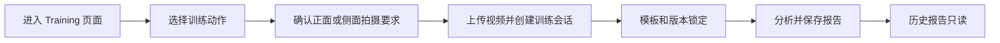

# Training 五模板下一阶段状态、风险与开发计划

> 2026-09-27 文档导航更新：新增 [假期班开发交接](./holiday-camp-development-handoff-2026-09-27.md)。本文件仍是动作评分/模板/真实视频验收的主索引；新训练计划、课次、营养与 UI 进度见 [假期班开发计划](./holiday-camp-development-plan.md)。本次未重新验证以下 9 月 22 日测试和本地数据库状态，也未修改评分规则。

更新日期：2026-09-22
适用分支：`developbranch` 当前工作区  
关联文档：

- [2026-09-19 上传视频与 Report 开发交接](./training-five-template-upload-report-handoff-2026-09-19.md)
- [training-five-template-end-to-end-development-plan.md](./training-five-template-end-to-end-development-plan.md)
- [training-five-template-metrics-development-plan.md](./training-five-template-metrics-development-plan.md)

### 2026-09-22 Training 年龄选择修复（最新）

问题由历史报告保护逻辑造成：保存后的 Training 报告禁用年龄选择，且首次生成固定使用 16–18。现已接通年龄选择，保留现有评分公式与模板数据。

- 上传分析页面在生成报告按钮旁提供 Age Group；生成分数、建议、score context 和摘要使用同一个选定年龄。
- 自己的已保存 Training 报告可以切换年龄预览。重算只使用该报告的服务端模板快照与 saved metrics，不读取当前模板替换历史规则，也不重新聚合测量数据；图表评分区间使用相同年龄参数。缺失数据仍为 N/A。
- 点击 Save as new report 才保存，Cancel 恢复原结果。未保存预览暂不允许复制分享链接，避免分享原结果却显示预览分数；共享报告及他人的报告保持只读。
- 新接口 `POST /api/v1/reports/{id}/reanalyze-age` 验证所有者及 Training 类型，保留原 session/video/template version，另建报告和快照。原报告及原采集数据不更新。保存请求 UUID 支持重复点击/失败重试去重。
- 重新评分结果不会新增训练 session，也不触发任务进度、成长快照和成就更新；后续这些汇总排除年龄对比报告。正常报告保存不会误覆盖年龄对比报告。
- 本轮沿用项目现有客户端评分引擎；服务端锁定并复制模板、测量值、时间线和来源信息，校验评分结构，尚未扩展为服务端权威重新评分。
- 验证：前端 161 项、后端 43 项通过；新增 SQLite 内存数据库用例验证保存、重复重试、刷新恢复、权限、原报告不变及源数据不可由请求替换。TypeScript 和定向 ESLint 通过。运行中的本地 8000 OpenAPI 已加载新接口及权限字段，3000 报告路由返回 200。
- 未使用真实用户报告写入作验证，未完成已登录浏览器点击/真实视频端到端验收；未重启服务、未迁移数据库、未提交/push。用户刷新自己的报告页面即可使用新控件。

### 2026-09-22 原五模板匹配完成

用户明确选择“保留当前代码中的旧五动作规则（v2），只同步匹配，不改公式和数据”，没有选择恢复数据库中更早的 `local-v1` 评分规则。

- 为高抬腿、前臂平板、标准靠墙静蹲、浅靠墙静蹲及徒手深蹲各新增一条 `v2` 版本，并设为当前默认版本；本地 `ai_hoops` 同步后再次预览为 skip 5、update 0、create 0、blocked 0。
- 十个 Training JSON 以及 `scoring.ts`、`trainingCalculator.ts`、`trainingAggregators.ts`、`trainingTemporal.ts`、`trainingGeometry.ts`、`trainingReport.ts` 的同步前后 SHA-256 一致。本轮没有修改分析公式、指标计算、阈值、权重或输入数据处理。
- 原 `local-v1` 规则、指标定义及其他内容保留；仅默认标记及其自动维护时间变更。新五个 `v1` 模板和其他无关模板记录保持不变。
- `analysis_reports`、`report_snapshots`、`training_sessions` 全表行数及内容指纹均与同步前一致；未重算或改写历史报告。
- 运行中 API 返回的目录通过前端原有 `buildTrainingTemplateCatalog()` 校验：十个模板全部为 `ready`。数据库新增的五条 v2 原始规则与本地 JSON 深度相等；五动作、多年龄组及理想值/边界/越界/缺失输入共 125 组评分对比结果完全一致。该证据证明规则匹配与固定输入评分一致，不代表真实视频识别已验收。
- 同步前备份：`tmp/existing-training-v2-backup-20260922.json`；同步后校验：`tmp/existing-training-v2-result-20260922.json`。初次同步后的严格核对因自动 `updated_at` 变化而停止记录，随后确认只有默认标记/时间变化，并仅运行验证，不重复 apply。

用户刷新 Training 页面后可重新选择全部十个动作。完整视频上传、报告保存与刷新验收仍需继续；未重启服务、未提交/push。

### 2026-09-22 本地新五模板同步结果（前一步）

用户确认继续，并已自行启动前端 3000 与后端 8000；页面截图仍显示新五模板未同步、原五模板版本不匹配。已按上轮确认范围仅向 `localhost:5432/ai_hoops` 新增五个 Training `v1` 模板。

- 先以只读事务重新预览，并保存全部模板/版本表的同步前备份：`tmp/training-template-backup-20260922.json`。没有备份账号、视频或登录凭据。
- 使用同一范围的最新预览 token 执行服务层同步：新增 5、更新 0、冲突 0。作为本地维护操作执行，创建人字段为空，未冒用其他账号。
- 二次预览：skip 5、create 0、update 0、blocked 0；逐行确认同步前全部模板/版本记录保持不变。结果记录在 `tmp/training-template-sync-result-20260922.json`。
- 从运行中的 `/api/v1/training-templates?analysis_type=training` 读取真实目录，再执行前端现有 `buildTrainingTemplateCatalog()`：新五个动作均为 `ready`，版本、声明 hash、实际规则 hash 一致；指标数量分别为开合跳 6、同侧弓步蹲 6、俯卧撑 5、单腿站立 6、双脚跳绳 6。
- 原五个 Training 仍为 `local-v1`，继续显示 `version_mismatch`；它们不在本次五模板新增范围中。
- 当前目录只在页面挂载时读取，用户须刷新 Training 页面才能取得新状态。独立浏览器验证页停在登录页，未完成登录后点击或真实视频上传验收；不能把目录 Ready 等同于完整报告验收。

下一步：刷新页面，先选择 Push-Up 并使用侧面全身可见视频验证上传、分析、保存及刷新报告，再覆盖其余新动作。本轮未重启服务、未改原模板或历史报告，未提交/push。

### 2026-09-22 本地可用性首次核查

本次确认的是当前本地开发环境，不代表测试站或生产环境。数据库检查均在 PostgreSQL `READ ONLY` 事务内执行，没有同步模板或修改业务数据。

- 本地 `ai_hoops` 数据库正在运行，migration head 为 `20260503_0003`；3000/3001/8000 未发现本地监听，前后端服务未启动。
- 新五个模板在代码中均为 `v1`，但本地数据库均没有对应模板记录。因此目前 Training 目录不能将它们标记为 Ready。
- 限定 `jumping_jack_reps_front`、`lunge_same_side_reps_side`、`pushup_reps_side`、`single_leg_stand_front`、`jump_rope_basic_front` 的实际服务层 dry-run：`created=5, updated=0, skipped=0, new_versions=0, blocked=0`。仅预览，未 apply；后续 apply 前必须重新预览并使用当次 token。
- 原五个模板在此数据库中仍只有 `local-v1`，与代码的 `v2` 不匹配。本次五模板同步范围不包含它们；只新增五个动作不会自动使十个动作全部 Ready。按 `training_template_id + template_version` 查询，这五条旧版本记录各有 0 条直接关联 report，此结果不等同于所有历史数据均已审计。
- 修改前基准重新验证：前端 126 项、后端 35 项通过，TypeScript 检查通过。现有 `server/.venv` 启动器指向已不可用的 Python 路径；本次后端测试使用 Codex 自带 Python 3.12，配合该虚拟环境的已安装包执行，没有修改虚拟环境。
- 本次已补齐 Training 生成前 code/version/hash 复核，按钮与 handler 共用时序/聚合/评分门槛，保存默认年龄参数与实际最少指标数 2；保存失败保留数据并显示重试入口，保存中禁止重复提交、播放及清除视频。
- MediaPipe 初始化失败现在进入 error，失败脚本允许重新加载；新增自动重试和显式从头采集入口。Training 普通回放不再追加采样，显式重采集仅接受递增时间，避免重复尾帧污染结果。旧 Shooting/Dribbling 评分规则未改。
- 修改后验证：前端 **144/144**（新增 18 项）通过，TypeScript 与 6 个改动前端文件的定向 ESLint 通过；后端 **35/35** 通过。新增测试覆盖五动作完整/不完整数据、Consistency 缺失、方向提示、规则变更和采集去重等逻辑；不代表已经完成浏览器、CDN 失败重试或真实视频验收。
- 真实上传、存储、视频识别、保存和刷新验收尚未执行。代码和本文件修改仍在工作区，未 commit/push。

允许本地使用前的下一步：确认启动本地服务和限定五模板同步的授权；备份相关模板/版本数据，重新 dry-run 后仅新增这五个 v1，再次 dry-run 应全部 skip；以真实侧面俯卧撑视频完成上传、分析、保存、GET/刷新恢复，随后覆盖另外四个动作。

### 2026-09-19 交接与进度

本文件继续作为状态与风险主索引，不被交接文档替代。下一阶段目标是让新增五个动作在真实登录环境中完成 `选择模板 -> 上传 -> 端侧分析 -> 保存 report -> 刷新后读取 report`；具体入口、顺序和验收记录见上方交接文档。

| 工作项 | 当前进度 | 下一步证据 |
| --- | --- | --- |
| 五个新模板、指标聚合及统一报告图表 | 代码已实现 | 正确/典型错误视频的真实结果 |
| 上传前模板目录与会话版本锁定 | 代码已接入 | 目标库 catalog、上传响应和保存请求一致 |
| 后端模板与报告关联、可信规则快照 | 代码已实现 | PostgreSQL 保存、读取及刷新验收 |
| 目标数据库模板发布 | 未核实、未执行本次同步 | 备份、版本审计、dry-run/apply/二次 skip |
| 五个动作实际上传并得到持久化 report | 未完成验收 | 每个动作至少正确/错误视频各一条 |
| 生产发布与安全门槛 | 未完成 | 本文第 8、11、12 节风险和验收项 |

2026-09-19 只核对代码并更新交接、开发和进度文档；未改应用代码、评分阈值或数据库，未启动/打开 3000/8000，未重新运行测试，未 commit/push。分析完成后沿用现有生成报告按钮，不把新增 Worker 或自动保存作为本阶段前置要求。

### 2026-09-18 代码提交

| Commit | 更新内容 |
| --- | --- |
| `f8301d9` | 隔离旧运球/投篮评分策略，35 组发布基准，十个 Training 多年龄边界测试；不改评分区间定义 |
| `307c313` | 原五个版本标记 v2，限定同步范围，预览 token、冲突整批拒绝、发布版本及 PATCH 保护，Admin 完整预览 |
| `f715146` | 删除 Training 硬编码图表，保留 N/A，读取锁定快照及实际年龄区间，服务端快照保护，旧深蹲夹具与静态渲染回归 |

这三笔代码提交及随后文档提交只推送 developbranch，不同步 main，不包含原有 Landing/Phase 2 工作区改动。目标数据库、服务启动和真实视频验收不属于本轮已执行操作。

## 1. 文档目的

本文档回答以下问题，并作为下一阶段开发和上线前验收依据：

1. 原有五个 Training 模板的评分现在修改成了什么。
2. 五个运球模板是否被修改，以及共享评分器是否带来间接影响。
3. Training 报告不能切换模板后，用户应该在哪里选择训练动作。
4. 新增五个模板是否需要修改数据库，是否需要新增 Alembic migration。
5. 当前已经完成什么、尚未完成什么、下一步先做什么。
6. 当前系统有哪些功能风险、数据风险和安全风险。

## 2. 结论先行

### 2.1 原五个 Training 模板不只是删除指标

此前“保留全部有效指标，只删除禁用项”的表述过于简化。当前代码还包含以下有意调整：

- 删除时长、次数、绝对速度和正确帧比例评分。
- 重新分配被删除指标留下的同分类权重。
- 将墙靠静蹲的膝角深度从 Posture 调整为 Execution。
- 将前臂平板支撑的支撑肘角从 Posture 调整为 Execution，并把目标改为肩膀位于约 90 度肘部正上方。
- 所有 Training 模板统一使用 `Posture 40% + Execution 40% + Consistency 20%`。
- 一次完整动作可以评价 Posture 和 Execution；Consistency 数据不足时显示 `N/A`，并将总分权重重新归一化。

### 2.2 运球和投篮已隔离为原有评分策略

当前工作区没有修改以下文件或运球时序聚合器：

- `web/src/config/templates/dribbling/*.json`
- `web/src/lib/dribbleCalculator.ts`
- `web/src/lib/dribbleTemporal.ts`

因此五个运球模板的指标、目标值、容差和指标权重没有直接改动。

`web/src/lib/scoring.ts` 现在按 mode 隔离行为：Training 使用 availability-aware 评分；Shooting/Dribbling 保留发布基准的缺失项计零、原分类权重、建议和正向标记规则。没有修改运球/投篮 JSON 或时序算法。

`legacyScoring.test.ts` 从发布提交 `299aaf3` 固定了 35 组期望输出，覆盖五个运球、两个投篮的正常值、越界、年龄/左右手、部分缺失和全部缺失；分数、分类、权重、标题和建议验证通过。此证据只覆盖固定指标输入，不等于真实视频端到端验收。原评分器不支持的投篮指标类型也保留既有输出，不在本轮顺带升级。

### 2.3 Training 模板应该在上传前选择

当前设计不是在历史报告页重新选择模板，而是：


```mermaid
flowchart LR
    A["进入 Training 页面"] --> B["选择训练动作"]
    B --> C["确认正面或侧面拍摄要求"]
    C --> D["上传视频并创建训练会话"]
    D --> E["模板和版本锁定"]
    E --> F["分析并保存报告"]
    F --> G["历史报告只读"]
```

- 自由训练：在上传区上方的模板卡片中选择动作。
- Coach 任务：模板由任务指定，用户不能替换。
- 上传完成后：模板随上传会话锁定，避免分析和报告使用不同动作规则。
- 清除当前视频后：返回模板选择区，可以选择其他动作并重新上传。
- 已保存报告：不能切换模板后覆盖原报告。

当前尚未实现“同一视频显式选择另一个动作并创建一份新分析”的流程。若产品需要该能力，应增加“使用其他模板重新分析”命令，并创建新的上传会话和新报告，不能修改历史报告。

### 2.4 需要同步数据库数据，但当前不需要新增 Alembic migration

数据库表已经由以下现有 migration 创建：

- `server/alembic/versions/20260427_0002_training_camp_core.py`
- 表：`training_templates`
- 表：`training_template_versions`
- `training_sessions` 已有 `template_code` 和 `template_version`
- `analysis_reports` 已有 `training_template_id` 和 `template_version`

本轮没有新增或修改数据库列、索引或约束，因此：

- 不需要为五个新模板创建新的 Alembic revision。
- 需要把模板 JSON 作为业务数据同步到现有表。
- 如果目标数据库还没有应用 `20260427_0002`，则需要执行已有 migration 到 `head`，这不等于为本功能新增 migration。

数据同步入口：

- Admin 页面：`/admin/templates`
- 预览：`POST /api/v1/admin/training-templates/sync-local?dry_run=true`
- 应用：`POST /api/v1/admin/training-templates/sync-local?dry_run=false&preview_token=<预览返回值>`

接口默认 `analysis_type=training`，可重复传入 `template_codes`。代码已加入版本保护，但正式应用前仍须备份、审核完整预览并完成测试环境验收。

### 2.5 评分指标和图表必须按版本一一对应

指标新增或删除后，对应图表必须同步新增或删除，但判断依据不是“当前代码里有哪些图表”，而是“这份报告锁定版本的 JSON 定义了哪些指标”。

硬性规则：

- 每个模板指标对应一个 Finding、一张评分卡和一张图表或聚合摘要。
- 三者数量和顺序都等于锁定版本 `metrics` 数组。
- 图表评分目标区间直接读取同一指标的 `target/tol` 或 `L/U`：`target ± tol` 保持现有 90-100 分规则，`[L,U]` 保持现有 100 分规则。
- 历史报告使用保存时的模板快照；当前 JSON 更新不能改变历史报告的指标或图表。
- 指标缺失时显示 `N/A` 图表，不能直接少画一张。

截图中的深蹲报告显示 `7 Checks`，但 Performance Curves 只有 `6` 张。原因是 Findings 来自包含 `Rep Rhythm` 的旧保存结果，而图表来自已经删除该指标的当前模板代码。这是确认存在的版本混用问题，不是单纯的计数样式问题。

## 3. 当前统一评分公式

### 3.1 Range 指标

目标区间为 `[L, U]`，区间外缓冲距离为 `margin`：

```text
L <= x <= U: score = 100
x < L:        score = max(0, 100 - 100 * (L - x) / margin)
x > U:        score = max(0, 100 - 100 * (x - U) / margin)
```

### 3.2 Target 指标当前实现（保持不变）

目标为 `T`，容差为 `tol`，容差外缓冲为 `margin`：

```text
d = abs(x - T)

d <= tol:
score = 100 - 10 * d / tol

d > tol:
score = max(0, 90 - 90 * (d - tol) / margin)
```

因此目标点为 100 分，`target ± tol` 是 90-100 分目标区间，容差边缘为 90 分；超出该区间后继续按 `margin` 线性降分。下一阶段不得修改这一定义，也不得借图表改造改变旧 Training、Shooting 或 Dribbling 的发布结果。

### 3.3 图表评分目标区间解析规则

评分器和图表必须共用一个 resolver，输入为锁定版本 Metric 与评分上下文，输出至少包括目标区间上下界、目标点、区间内分数语义和降分边界。

| JSON 指标 | 图表目标区间 | 现有评分语义 |
| --- | --- | --- |
| `type: range` | `[L,U]` | 区间内 100 分；`margin` 仅为区间外降分距离 |
| `type: target` | `[target-effectiveTol, target+effectiveTol]` | 区间内 90-100 分，越接近 `target` 越接近 100 分 |
| `type: rangeByOption` | 当前 option 对应的 `[L,U]` | 区间内 100 分；使用对应 option 的 `margin` |

禁止在 `MetricTimelineCard.tsx` 或专用模板组件中再次手写目标区间。图表目标带、Finding 的目标文本和评分器必须使用同一次参数解析结果；图表展示不能反向改变评分公式。

### 3.4 分类与总分

1. 每个分类内部按模板中的指标权重计算加权平均。
2. 正常情况下总分为：

```text
Overall = Posture * 0.40 + Execution * 0.40 + Consistency * 0.20
```

3. 一次完整动作导致 Consistency 不可用时：

```text
Overall = Posture * 0.50 + Execution * 0.50
Consistency = N/A
```

4. 如果 Posture 或 Execution 整个分类没有可用指标，则 `analysisStatus = insufficient_data`，不生成可用总分。
5. 年龄容差配置仍会对 `tol` 和 `margin` 应用倍率。

## 4. 原有五个 Training 模板现在的评分

### 4.1 Bodyweight Squat，侧面

| 分类 | 当前指标 | 目标 | 分类内权重 |
| --- | --- | --- | ---: |
| Posture | Chest Position | 躯干前倾 `0-45°` | 0.50 |
| Posture | Knee Position | 膝盖相对脚尖偏移 `-0.05-0.15` | 0.50 |
| Execution | Squat Depth | 髋部相对膝线目标 `-0.20 ± 0.32` | 0.50 |
| Execution | Top Position | 顶部膝角 `175° ± 10°` | 0.50 |
| Consistency | Repeatable Squat Depth | 深度波动目标 `0.03 ± 0.02` | 0.50 |
| Consistency | Stable Chest Position | 躯干角波动目标 `4° ± 2°` | 0.50 |

已删除：

- `repTempoSec`
- 按单次动作耗时评价 Execution

权重变化：Execution 从“深度 0.60、顶部 0.20、节奏 0.20”调整为“深度 0.50、顶部 0.50”；Consistency 调整为两个保留指标各 0.50。

### 4.2 High Knees，侧面

| 分类 | 当前指标 | 目标 | 分类内权重 |
| --- | --- | --- | ---: |
| Posture | Upright Body | 躯干 `0° ± 12°` | 0.50 |
| Posture | Foot Landing Position | 脚落在髋部下方 `-0.10-0.10` | 0.50 |
| Execution | Knee Lift Height | 膝盖接近髋高，比例 `1.00 ± 0.20` | 1.00 |
| Consistency | Repeatable Knee Height | 抬膝高度波动 `0.30 ± 0.10` | 0.50 |
| Consistency | Steady Step Rhythm | 相邻动作节奏变化 `0.20 ± 0.10` | 0.50 |

已删除：

- `cadenceSPM`
- 每分钟步数或固定速度目标

保留的 Steady Step Rhythm 只评价相邻动作是否忽快忽慢，不评价动作必须达到某个绝对速度。报告不显示 `CV` 术语。

### 4.3 Forearm Plank，侧面

| 分类 | 当前指标 | 目标 | 分类内权重 |
| --- | --- | --- | ---: |
| Posture | Straight Body Line | 肩、髋、踝身体线 `172° ± 8°` | 1.00 |
| Execution | Support Elbow Angle | 肩膀位于约 90 度肘部上方，`90° ± 10°` | 1.00 |
| Consistency | Body Stability | 身体线角度波动 `3° ± 2°` | 1.00 |

已删除：

- `goodFormFrameRatio`
- Shoulder Stack 独立评分
- 按视频中正确姿态帧占比评分

其他调整：

- 原 `P_elbow_lockout` 被改为 `E_support_elbow_angle`。
- 目标从约 `85°` 调整为约 `90°`。
- 模板名称从 High Plank 明确为 Forearm Plank。

### 4.4 Wall Sit，侧面

| 分类 | 当前指标 | 目标 | 分类内权重 |
| --- | --- | --- | ---: |
| Posture | Back Against the Wall | 躯干接近垂直，`0° ± 5°` | 0.60 |
| Posture | Knee Position | 膝盖和脚部位置 `-0.05-0.08` | 0.40 |
| Execution | Wall Sit Depth | 膝角 `90° ± 10°` | 1.00 |
| Consistency | Stable Wall Sit Depth | 膝角波动 `3° ± 2°` | 1.00 |

已删除：

- `holdDurationSec`
- 保持 30 秒之类的时长目标

其他调整：膝角从 Posture 移到 Execution，因为它表示动作是否下到指定深度。

### 4.5 Shallow Wall Sit，侧面

| 分类 | 当前指标 | 目标 | 分类内权重 |
| --- | --- | --- | ---: |
| Posture | Back Against the Wall | 躯干接近垂直，`0° ± 5°` | 0.60 |
| Posture | Knee Position | 膝盖和脚部位置 `-0.10-0.05` | 0.40 |
| Execution | Shallow Wall Sit Depth | 膝角 `135° ± 10°` | 1.00 |
| Consistency | Stable Wall Sit Depth | 膝角波动 `3.5° ± 2.5°` | 1.00 |

已删除：

- `holdDurationSec`
- 保持时长评分

其他调整：膝角从 Posture 移到 Execution。

## 5. 新增五个 Training 模板状态

| 模板 | 拍摄方向 | 完整动作/有效区间 | 状态 |
| --- | --- | --- | --- |
| Jumping Jack | 正面 | 合拢到展开再回到合拢 | 已实现并注册 |
| Same-Side Lunge | 侧面 | 站立、下蹲、回到站立，同一侧连续 | 已实现并注册 |
| Push-Up | 侧面 | 顶部、底部、回到顶部 | 已实现并注册 |
| Single-Leg Stand | 正面 | 抬脚后的可用平衡区间，不按时长计分 | 已实现并注册 |
| Basic Two-Foot Jump Rope | 正面 | 双脚地面、腾空、回到地面 | 已实现并注册 |

当前代码已经完成：

- 本地 JSON 模板和前端注册。
- 时间戳、滞回阈值和状态机分段。
- Posture、Execution、Consistency 指标聚合。
- 单次动作 Consistency `N/A`。
- 模板目录、版本、content hash 和上传会话锁定。
- Coach 任务模板校验。
- Training 报告模板只读。
- 2026-09-18 已记录前端 126 个测试、后端全部 35 个测试（其中 21 个模板/报告相关）、TypeScript 和定向 ESLint 通过；没有启动服务，也没有执行该轮生产构建。2026-09-19 仅文档核对，未重新运行这些检查。

当前报告主路径已使用统一数据驱动图表：新分析读取当前选定 JSON，历史 Training 报告读取后端提供的锁定模板快照。每项保留图表或聚合摘要，缺失显示 N/A；全部数据缺失也不再隐藏整个图表区。版本缺失或 Findings 顺序/数量不符时显示错误，禁止混用当前规则。

原五个 Training 的旧硬编码回退分支及其专用计算辅助函数已删除，运球分支保持原样。使用发布提交 `299aaf3` 的真实旧深蹲 JSON 固定夹具，覆盖旧版 7 项/新版 6 项模型和静态渲染；截图对应的真实历史报告尚未在目标数据库/浏览器验收。

## 6. Training 模板选择现状与问题

### 6.1 当前行为

自由训练进入 `/pose-2d/training` 后，页面会同时读取：

1. 前端本地十个 Training JSON 模板。
2. 后端 active Training 模板目录。
3. 对比 `template_code + version + content_hash`。

只有三项一致的模板才可点击并上传。

### 6.2 为什么用户可能看到“不能切换”

| 场景 | 当前表现 | 是否符合设计 |
| --- | --- | --- |
| 数据库尚未同步 | 模板卡存在但不可上传 | 符合安全门槛，但提示仍可改善 |
| 数据库版本或 hash 不一致 | 对应模板不可用 | 符合设计 |
| Coach 任务 | 只能使用任务指定模板 | 符合设计 |
| 视频已经上传 | 模板选择器隐藏，当前会话锁定 | 符合数据一致性设计 |
| 历史 Training 报告 | 模板下拉框只读 | 符合历史报告不可覆盖设计 |
| 想用同一视频换模板重新评分 | 当前没有显式入口 | 未完成的产品能力 |

### 6.3 下一阶段需要改善的交互

1. 在上传区显示明确步骤：`选择动作 -> 查看拍摄要求 -> 上传视频`。
2. 上传后持续显示“当前锁定模板、版本和拍摄方向”，不要只隐藏选择器。
3. 将清除操作明确命名为“更换动作或视频”，返回模板选择区。
4. 增加“使用其他动作重新分析”流程时，必须创建新 session 和新 report。
5. 历史报告保持不可直接改模板，提供“基于此视频创建新分析”命令，而不是覆盖原结果。
6. 数据库未同步时，提示管理员去 `/admin/templates` 执行 dry-run，而不是只显示模板不可用。

## 7. 数据库和 Alembic 决策

### 7.1 当前是否需要新 migration

| 变更 | 是否需要 Alembic |
| --- | --- |
| 新增五个模板记录 | 否，只需数据同步 |
| 更新原五个模板规则 | 否，创建 v2；不得覆盖已发布 v1 |
| 使用现有模板、版本、会话和报告字段 | 否 |
| 新增 `training_template_version_id` 外键 | 是，未来加强项 |
| 在 session 中新增不可变 `content_hash` | 是，未来加强项 |
| 新增服务端分析任务表或原始关键点表 | 是，未来功能 |

### 7.2 当前同步实现的影响范围

`AdminService.sync_local_training_templates()` 默认仅扫描：

```text
web/src/config/templates/training/*.json
```

已完成以下范围保护：

- 默认 `analysis_type=training`；其他模式须明确选择。
- 可选 `template_codes` 白名单，跨模式或未知 code 返回 400。
- Admin 先预览，变更范围后使预览失效；列表显示全部动作、版本、原因。
- API apply 必须提供预览返回的 preview_token；范围、内容或计划操作变化后拒绝旧 token，要求重新预览。
- 每项显示 create、new_version、draft_update、metadata_update、skip 或 blocked。
- 规则比较基于实际 JSON 内容，不能只信任声明 hash。
- 整批预检查；存在 blocked 时 apply 返回 409，整批不写入。

### 7.3 已实施不可变版本策略

原五个修改模板均声明 `v2`，五个新模板从 `v1` 开始；前后端校验接受 `v1/v2/...`。无需 schema migration。

active、曾发布或已被会话/报告引用的版本规则不得修改，归档也不解除保护。sync-local 与手动版本 PATCH 都执行该限制。未发布且无引用的 draft 可以修改后发布；不变规则可以重新选为当前默认版本。

仍需审计以前是否已经覆盖过 v1：本轮保护不能恢复过去丢失的内容。受污染历史版本只能从备份、当时提交或报告原始快照核实并受控修复，不能猜测后静默回填。

### 7.4 推荐的数据同步顺序

1. 备份目标数据库或至少导出模板、版本和报告引用关系。
2. 查询原五个模板的 `v1` 是否已被 `analysis_reports` 使用。
3. 原五个模板创建 `v2`，保留并核验旧 `v1` 内容；若 v2 已发布但内容不一致，必须继续递增版本，不得覆盖。
4. 在测试环境执行 Training-only dry-run。
5. 审核每项动作、版本、操作和原因；存在 blocked 时先解决冲突。
6. 在测试环境 apply。
7. 再次 dry-run，结果应全部为 skip。
8. 验证 public catalog 返回十个 active Training 模板及正确 hash。
9. 完成真实视频验收后再对生产环境执行同样流程。

## 8. 当前风险与漏洞

### 8.1 P0：共享评分器可能影响旧运球和投篮结果

状态：代码层已处理，35 组发布基准通过。
剩余：需要真实旧视频冒烟，不能把指标输入测试等同于识别链路无回归。
处理：保留模式隔离；非有限输入按缺失处理，不接受 NaN/Infinity。

推荐策略：

- 保留模板 JSON 不变。
- 为评分器增加明确的 `scoringPolicy` 或版本策略。
- 旧 Shooting/Dribbling 在未确认升级前继续使用基准行为。
- Training 使用新的 availability-aware 行为。
- 只有产品确认并有版本记录后，才升级旧模板评分策略。

### 8.2 P0：报告评分项与图表数量、阈值可能不一致

状态：统一图表路径已修复，Training 硬编码分支已删除；历史真实数据和浏览器验收未完成。
影响：历史 Findings 可能保留旧指标，但图表按当前模板生成，导致深蹲出现 `7 Checks/6 Charts`；图表中手写的目标带还可能与 JSON 评分区间漂移。用户看到的图形不能可靠解释对应分数。

此前根因（已在代码层处理）：

- Findings、评分卡和图表没有从同一个锁定模板快照生成。
- `MetricTimelineCard.tsx` 同时存在数据驱动和原五模板硬编码分支。
- 报告只传入 `templateId`，不足以恢复同 ID 的历史版本规则。
- 图表目标带可能使用组件内手写阈值，未必与锁定版本 JSON 的 `target/tol` 或 `L/U` 一致。

处理：

1. 报告保存或读取锁定版本模板快照。
2. 由一个 Training 图表组件遍历该快照的 `metrics`，每项生成一张图或 N/A 摘要。
3. 建立共享 `resolveMetricScoreBand()`，评分器和图表使用同一结果。
4. 删除 Training 专用组件中的手写评分阈值。
5. 增加深蹲旧版 7 对 7、新版 6 对 6 的回归测试。

### 8.3 P0：模板同步范围过大且可能覆盖历史版本

状态：代码层已处理，SQLite 服务测试通过，目标 PostgreSQL 尚未同步。
保护：默认 Training-only、code 过滤、内容比较、整批冲突拒绝、过期预览拒绝、手动 PATCH 不可绕过。
剩余：真实库备份、历史版本审计、并发写入/数据库约束和部署目录可用性验证。

### 8.4 P0：服务端信任浏览器提交的分数和指标

状态：确认存在评分完整性风险。  
影响：后端会校验 session、template 和 version 是否一致，但不会根据视频在服务端重新计算动作指标和总分。已登录用户可以修改客户端或请求负载，提交不可信的分数。若分数用于 Coach 任务达标、排名或奖励，风险较高。

分阶段处理：

1. 短期：后端根据数据库模板规则重新计算总分，不直接信任客户端 `overall_score`。
2. 中期：保存并校验受约束的指标输入，增加范围和结构校验。
3. 长期：服务端或可信异步任务从视频重新提取关键点和指标。

仅在后端重算总分仍不能阻止用户伪造指标，但能先消除任意提交总分的问题。

### 8.5 P1：上传会话没有直接绑定不可变版本行

状态：已知架构限制。  
当前 session 保存 `template_code` 和版本字符串，没有 `training_template_version_id` 外键，也没有持久化不可变 content hash。

影响：API 已禁止发布版本修改，但无法防止绕过 API 的直接数据库写入，也缺少 session 级规则凭证。
处理：下一阶段评估新增版本外键和 content hash；此项需要 Alembic migration。

### 8.6 P1：真实儿童视频尚未完成验收

状态：未完成。  
当前测试主要使用合成关键点序列，不能证明以下情况：

- 遮挡、宽松衣服、不同身高和镜头距离。
- 手机竖屏、横屏、低光和抖动。
- 错误动作能否被宽松识别并给出低分，而不是直接判定数据不足。
- 12 FPS 下快速跳绳和开合跳的稳定性。

处理：每个新模板至少准备一条正确视频、一条典型错误视频，并对原五个 Training 和五个运球模板做冒烟回归。

### 8.7 P1：本地 HTTP 手机环境可能无法计算模板 hash

状态：兼容性风险。  
前端使用 `crypto.subtle.digest()` 计算 SHA-256。该 API 通常要求 HTTPS 或 localhost 安全上下文。手机通过局域网 IP 访问开发服务器时，可能导致模板目录构建失败。

处理：生产必须使用 HTTPS；本地移动端测试应使用可信 HTTPS tunnel，或增加不降低校验强度的服务端 hash 比对方案。

### 8.8 P1：模板选择与重新分析语义不够清楚

状态：功能已存在但交互容易误解。  
影响：用户可能把“历史报告不能切换”理解为“上传前不能选动作”。  
处理：增加步骤状态、锁定摘要和显式新分析入口。

### 8.9 P1：拍摄方向检测只是启发式提示

状态：已实现非扣分提示，但未经真实视频校准。  
影响：斜侧面、镜像或关键点遮挡时可能误判。  
处理：保持不扣分；用真实视频统计误报率后再调整阈值。

### 8.10 P2：依赖安全审计尚未完成

状态：未完成。  
当前已完成代码测试和构建，但还没有对生产依赖执行并处置完整的安全审计、许可证检查和升级回归。此项应独立处理，不能直接运行破坏性较大的自动升级命令。

### 8.11 P1：生成报告入口与实际评分门槛不完全一致

状态：2026-09-22 已完成以下代码修复和逻辑回归；真实浏览器及视频链路验收仍待完成。

- Training 按钮和生成处理共用 `prepareTrainingReport`，同时检查时序帧、聚合结果及可评分分类，界面不再仅凭普通帧采集完成就显示 Report ready。
- 生成报告前再次复核当前本地规则与上传会话的 code/version/hash，不一致时阻止提交并给出明确原因。
- Training 最低评分指标数 2 同时用于门槛和保存摘要，数据不足不保存伪成功的全零报告。
- 显式传入并保存当前实际使用的默认年龄组 `16-18`；尚未接入学生实际年龄，不能将此字段当作学生年龄已验证。
- 保存失败保留采集数据、提供重试，并阻止保存中清除视频。MediaPipe 初始化失败终态与显式重新采集路径已补齐，真实 CDN/模型失败和恢复仍需浏览器验收。

下一步：在本地服务与数据库模板发布就绪后，验证真实上传、模型失败重试、数据不足提示、保存失败重试及刷新恢复。逻辑测试不能代替该验收。

### 8.12 P1：上传代理与存储权限尚未闭环验证

状态：代理缺少自身身份、会话所有权和 bucket 白名单校验；实际 Supabase RLS/Storage 策略未知，尚不能宣称可被利用。

影响：`/api/storage/upload` 接收调用方提供的 bucket/object key，现有路径格式检查不等于授权；上传完成 API 主要登记 URL 和 metadata，没有验证存储对象确实存在、归属正确。视频大小、类型和代理资源限制也需要核对。

处理：核验外部 Storage 策略，并让代理目标取自已授权上传会话，验证登录、归属、允许 bucket 及文件限制；完成接口验证对象。公开发布前必须测试匿名请求、跨学生路径、任意 bucket 和不存在对象被拒绝。

### 8.13 P1：儿童视频链接与公开分享的隐私边界不足

状态：代码请求 `315360000` 秒的签名链接有效期（约十年），供应商是否接受未验证；公开报告读取路由按 UUID 查询，未见独立分享同意、到期和撤销校验。

影响：长有效期视频链接一旦泄露难以控制；UUID 难猜不等于访问授权。报告存在公开读取路径不代表用户已经同意公开儿童视频。

处理：采用受控短期签名和授权刷新，默认私有；明确分享同意、期限、撤销及最小披露范围。若为这些控制增加持久化字段，应单独设计 Alembic migration。内部测试可先验证私有主链路，不能据此跳过公开上线前隐私门槛。

## 9. 下一阶段开发顺序

### 阶段 0：先冻结旧功能基准，暂不执行生产 sync

当前状态：旧 Shooting/Dribbling 固定基准和策略隔离已完成；真实视频冒烟未完成。

目标：证明新功能不会改变旧模板的既有结果。

任务：

1. 从当前发布版本收集五个运球模板和两个投篮模板的固定指标输入与期望分数。
2. 新增 golden tests，逐项比较 overall、breakdown 和 finding 状态。
3. 为原五个 Training 模板记录“有意变化清单”，只允许清单内差异。
4. 如果旧模板出现非预期差异，增加评分策略隔离后再继续。

完成门槛：旧 Shooting/Dribbling 的关键数值输出与发布基准一致，或差异已经被产品明确批准并创建新版本。

### 阶段 1：修复报告版本来源和指标图表一一对应

当前状态：统一图表、共享区间、旧版夹具和静态渲染已完成；目标数据库历史报告的真实浏览器验收未完成。

目标：让同一份报告的 Findings、评分卡和 Performance Curves 全部来自同一个锁定模板版本，先解决截图中的 `7 Checks/6 Charts`。

任务：

1. 将该深蹲历史报告固定为回归用例，保存其模板版本、7 个 Findings 和可用指标数据。
2. 报告保存或读取锁定版本的模板快照，至少包含 `templateId`、`version`、`metrics`、分类权重和 content hash。
3. Training 图表按锁定快照的 `metrics` 顺序生成，每个指标只生成一张图表或聚合摘要。
4. 缺少指标数据时保留对应位置并显示 `N/A`，不能通过少画图表掩盖版本或数据问题。
5. 建立共享 `resolveMetricScoreBand()`，让评分器、目标文案和图表读取相同的 `target/tol`、`L/U`、`margin` 及年龄上下文。
6. 删除原五个 Training 专用图表分支中的手写评分阈值，但保留现有评分公式和数值结果。
7. 找不到历史锁定版本时显示明确的版本数据错误，不得静默套用当前 JSON。

完成门槛：旧深蹲报告按旧版显示 7 个指标、7 个 Findings 和 7 张图；当前版本按当前 JSON 显示 6 对 6；`range` 的 `[L,U]` 仍为 100 分区间，`target ± tol` 仍为 90-100 分目标区间，目标点仍为 100 分。

### 阶段 2：修复模板版本和同步边界

当前状态：代码和服务测试已完成；测试 PostgreSQL 同步及并发验收未完成。

目标：保证数据同步不会影响无关模板，也不会覆盖历史版本。

任务：

1. Sync local API 支持 `analysis_type` 和 `template_codes`。
2. Admin UI 可以只预览和同步 Training。
3. 同步服务默认拒绝修改已发布版本的规则内容。
4. 原五个修改模板统一发布 v2，审计旧 v1，不覆盖旧规则。
5. 前端和后端校验器支持合法版本，而不是硬编码只能 `v1`。

完成门槛：Training-only dry-run 不列出任何无关 Shooting/Dribbling 更新；历史版本内容不可变。

### 阶段 3：完善模板选择和显式重新分析

目标：让用户明确知道在哪里选动作，以及为什么上传后不能直接切换。

任务：

1. 上传前步骤化模板选择。
2. 上传后显示锁定模板摘要。
3. 增加“更换动作或视频”。
4. 增加“使用其他模板创建新分析”，创建新 session/report。
5. Coach 任务继续保持模板锁定。

完成门槛：自由训练可在上传前选择十个可用模板；历史报告不会被覆盖；重新分析产生新报告。

### 阶段 4：测试环境数据库同步

目标：将十个 Training 模板安全写入现有数据库表。

任务：

1. dry-run。
2. 人工审核完整变更列表。
3. apply。
4. 第二次 dry-run 全部 skip。
5. 检查 active version、content hash、camera 和 metric count。

完成门槛：前端目录十个模板全部为 Ready，且上传会话返回相同 code/version/hash。

### 阶段 5：真实视频和旧模板回归

目标：验证动作识别和儿童反馈，而不只是验证代码可运行。

任务：

1. 五个新动作各测试正确和典型错误视频。
2. 原五个 Training 模板各做一次回归。
3. 五个运球模板和两个投篮模板各做一次冒烟测试。
4. 测试手机、平板和桌面。
5. 测试错误拍摄方向、遮挡、半个动作和短暂关键点缺失。

完成门槛：典型错误能被识别并产生可理解建议；视频长度和动作次数不直接提高质量分。

### 阶段 6：评分完整性加固

目标：降低客户端伪造分数的风险。

任务：

1. 后端重算并校验总分。
2. 报告 API 拒绝客户端总分与服务端结果不一致的请求。
3. 评估 session 绑定版本外键和 content hash 的 migration。
4. 为任务达标和排名使用可信评分来源。

## 10. 下一步最先做什么

下一阶段以 [上传视频与 Report 交接](./training-five-template-upload-report-handoff-2026-09-19.md) 为执行指南。在任何生产数据库同步之前，按以下顺序执行：

1. **确认测试环境、API/Storage 配置和测试账号；备份并审计旧 v1、报告引用和截图历史报告，不猜测缺失规则。**
2. **取得目标库操作授权后，在测试 PostgreSQL 执行 Training-only 预览、apply、二次全 skip，验证新五个 v1、原五个 v2 和 hash。**
3. **服务由用户运行或另行授权；先用一条侧面俯卧撑视频走通 init、存储、complete、采集、聚合、POST report、GET/刷新 report。**
4. **修复真实阻塞及第 8.11 节门槛/版本/诊断问题，补失败重试，不能用全零分或当前模板回退绕过失败。**
5. **完成其余四个动作和五个动作的正确/错误视频验收，再做原模板、Coach 任务和历史报告回归及多设备检查。**
6. **关闭上传授权与儿童视频分享风险；服务端重算总分须在分数用于任务达标、排名或奖励前完成。**
7. **显式同视频新分析入口、版本外键和可信关键点提取为独立增强，不阻塞内部私有主链路验收，也不覆盖旧 session/report。**

当前不建议直接在生产点击 `Sync local`。

## 11. 下一阶段验收清单

- [x] 五个运球模板 golden scores 与发布基准一致（固定指标输入）。
- [x] 两个投篮模板 golden scores 与发布基准一致（固定指标输入）。
- [ ] 原五个 Training 只有已批准的指标、分类和权重变化。
- [ ] 每份报告满足锁定模板指标数、Findings 数和图表数一致，顺序和名称一致。
- [ ] 旧深蹲报告显示 7 个指标、7 个 Findings 和 7 张图；当前版本显示 6 对 6。
- [x] 图表区间直接来自锁定版本 JSON；组件中不存在 Training 手写评分阈值（模型/静态渲染验证）。
- [x] `range` 的 `[L,U]` 评分保持不变；`target ± tol` 仍为 90-100 分且目标点为 100 分（十个 Training、多年龄边界测试）。
- [ ] 修改当前 JSON 后重新打开历史报告，旧报告的指标、图表和目标区间不变。
- [x] Training-only sync 不触碰 Shooting/Dribbling（服务测试）。
- [x] 已发布模板版本内容不可变（sync/PATCH 服务测试；不包含直接 SQL）。
- [ ] 自由训练上传前可以选择动作。
- [ ] Coach 任务模板不能被替换。
- [ ] 上传后清楚显示锁定模板和版本。
- [ ] 换模板重新分析会创建新 session 和新 report。
- [ ] 新五个模板写入现有数据库，无不必要 schema migration。
- [ ] dry-run、apply、第二次 dry-run 顺序通过。
- [ ] 十个 Training 模板在目录中均为 Ready。
- [ ] 新五个模板正确视频和错误视频验收通过。
- [ ] 新五个模板均能保存 report，刷新/直接打开 URL 后仍能从后端读取，不能只依赖前端 store。
- [ ] 数据不足时明确阻断生成，按钮与实际门槛一致，不保存误导性全零报告。
- [ ] 生成前 code/version/hash 一致，报告摘要和年龄上下文与真实评分一致。
- [ ] 上传及保存失败可以明确定位并重试，不错误复用旧报告。
- [ ] 原五个 Training、五个运球和两个投篮冒烟测试通过。
- [ ] 报告不显示保持时长、动作次数、Good Form Ratio 或内部统计术语。
- [ ] 服务端至少能够重算并验证客户端提交的总分。
- [ ] 上传代理登录/所有权/bucket/文件限制及 Storage 策略验收通过。
- [ ] 视频访问默认私有，签名期限、分享同意、到期和撤销策略验收通过。

## 12. 当前发布判断

当前代码已经达到“功能开发和自动化逻辑验证”阶段，但尚未达到“可以无条件同步生产数据库并发布”的阶段。

主要阻止项是：

1. 目标库旧 v1 是否曾被覆盖尚未审计，截图历史报告尚未做真实验收。
2. 测试 PostgreSQL 同步、真实登录全链路和多设备 UI 验收未完成。
3. 五个新模板和旧模板缺少真实视频回归；固定输入测试已通过。
4. 服务端仍信任客户端提交的分数和指标；本轮只保证模板快照由服务端生成。
5. 移动 HTTP hash 风险、并发发布验证和依赖安全审计仍待处理。
6. 生成报告前版本/hash 和实际数据门槛需闭环，上传代理授权与儿童视频分享隐私门槛未通过。

完成第 9 节阶段 0 至阶段 5 以及上传授权、儿童视频隐私门槛后，方可评估受控发布；阶段 6 的评分完整性加固至少应在分数用于任务达标、排名或奖励之前完成。内部私有测试通过不等于公开发布许可。
